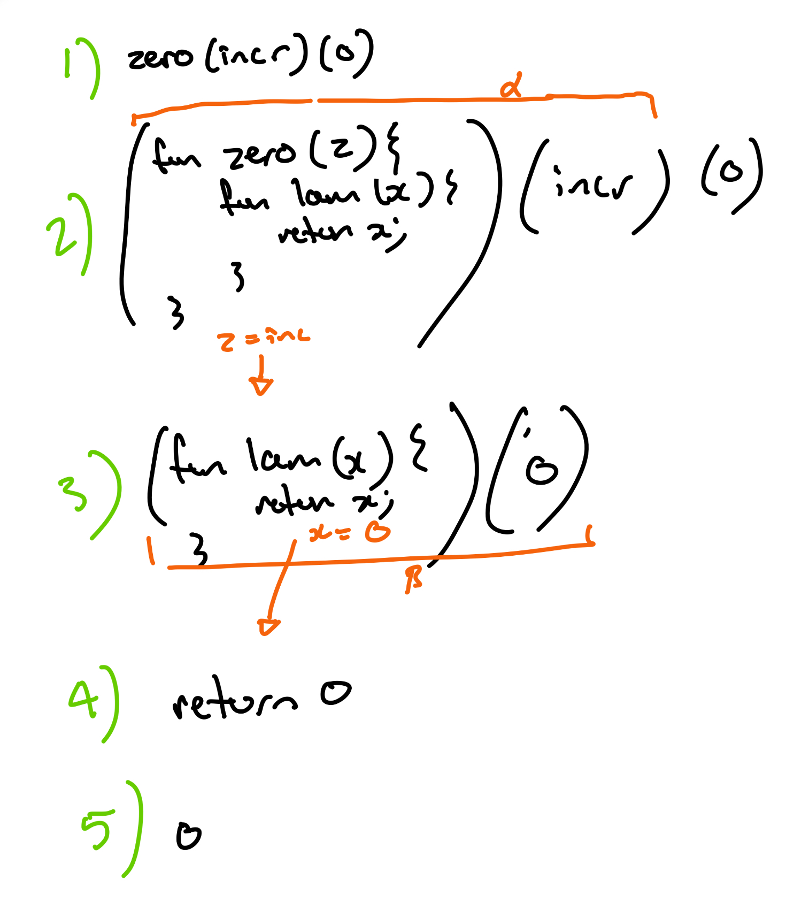

## Week Overview

This week we turn our focus to functions. Lox has first-class functions, so we spend some time thinking about these specifically.

## Goals

By the end of this week you should:

  * Be comfortable with the idea of expressions which evaluate to a function instead of values (or does that mean a function is a value?)
  * Be able to write Lox programs using these first-class functions
  * Have improved your Lox interpreter so it can evaluate calls to built-in functions

## Preparation

  * Read Chapter 10 of "Crafting Interpreters" up to section 10.3
  * Watch the following videos on echo360
    - Parsing function calls
    - Implementation mechanics
    - Functions as values

NB: function definitions is left until next week.

# RAT

## Handling Nested Functions <gift>
When parsing nested functions in Lox, how does the parser correctly manage scope and function boundaries? 
{
    ~It tracks function boundaries by resetting the parser state entirely for each nested function.
    =It uses recursion to parse nested function declarations, maintaining separate scopes for each.
    ~It parses nested functions in a single pass, merging their scopes into the parent function's scope.
    ~It prohibits nested functions in Lox to avoid scope management complexity.
}

## Error Recovery During Function Parsing <gift>
What strategy does the Lox parser use to recover from a syntax error encountered while parsing a function body? 
{
    ~It skips directly to the next top-level declaration, ignoring the rest of the function.
    ~It terminates parsing entirely until the error is manually corrected.
    =It synchronizes by skipping tokens until it finds the next statement boundary or closing brace.
    ~It rewinds to the beginning of the function and retries parsing using a fallback mechanism.
}

## anon church 1 <gift>
Given the following lox program, what is the output if the last line is replaced with `print(foo(bat)(0));`

<pre>
fun foo(z)\{
    fun lam(x)\{
        return x;
    \}
    return lam;
\}

fun bar(z)\{
    fun lam(x)\{
        return z(x);
    \}
    return lam;
\}

fun bat(x)\{
    return x+1;
\}

fun baz(m)\{
    fun lam1(n)\{
        fun lam2(f)\{
            fun lam3(x)\{
                return m(f)(n(f)(x));
            \}
            return lam3;
        \}
        return lam2;
    \}
    return lam1;
\}

print("last line");
</pre>
{
    =0
    ~1
    ~2
    ~a run time error
    ~"<native fn>"
}

## callable function 1 <gift>
What is the output of the following program if the last line is replaced with `print(functionOne(1));`

<pre>
fun functionOne(val)\{
    fun otherFunction(otherVal)\{
        print(val + otherVal);
    \}
\}

print("last line");
</pre>
{
    =nil
    ~1
    ~2
    ~error
}

## anon church 3 <gift>
Given the following lox program, what is the ouput if the last line is replaced with `print(baz(foo)(bar)(bat)(1));`

`````
fun foo(z)\{
    fun lam(x)\{
        return x;
    \}
    return lam;
\}

fun bar(z)\{
    fun lam(x)\{
        return z(x);
    \}
    return lam;
\}

fun bat(x)\{
    return x+1;
\}

fun baz(m)\{
    fun lam1(n)\{
        fun lam2(f)\{
            fun lam3(x)\{
                return m(f)(n(f)(x));
            \}
            return lam3;
        \}
        return lam2;
    \}
    return lam1;
\}

print("last line");
`````
{
    ~0
    ~1
    =2
    ~a run time error
    ~"<native fn>"
}

## anon church again <gift>
Given the following lox program, what is the output if the last line is replaced with `print(baz(foo)(bar)(bat)(0));`
<
`````
fun foo(z)\{
    fun lam(x)\{
        return x;
    \}
    return lam;
\}

fun bar(z)\{
    fun lam(x)\{
        return z(x);
    \}
    return lam;
\}

fun bat(x)\{
    return x+1;
\}

fun baz(m)\{
    fun lam1(n)\{
        fun lam2(f)\{
            fun lam3(x)\{
                return m(f)(n(f)(x));
            \}
            return lam3;
        \}
        return lam2;
    \}
    return lam1;
\}

print("last line");
`````
{
    ~0
    =1
    ~2
    ~a run time error
    ~"<native fn>"
}


# FAT

## dam semantics <tex-essay>
question: |
    Dams are human-controlled things.  A water manager can decide to let water out depending on the circumstances.  In fact, water managers will have a kind of "algorithm" they apply to help them make that decision consistently. 
    
    In a water management language, that "algorithm" would be expressed as a block of code with some input parameters and some output value.

    With a water management language we can experiment with different dam management algorithms to see how they will affect water flow.

    This week we would like your team to demonstrate \emph{three versions of the same dam} implemented in your language.  For example, if we were defining Googong dam I would like at least the following versions written in your language (in separate source files):\begin{itemize}
    \item Googong dam blocks exactly half the water that flows into it.
    \item Googong dam blocks exactly half the water that flows into it unless the rain that day was greater than 10mm.
    \item Googong dam blocks half the water that flows into it unless the flow into it is greater than 10L/s, in which case it blocks 75% of the flow.
    \end{itemize}

    Because the flow out of a dam depends on the flow into the dam, we suggest a function-like syntax will be most appropriate.  You will also need a way to find out today's rainfall which has so-far been implicit.  When you wrote your evaluator, you probably made some decision about how ti would appear - you may need to adjust that now.

    Once you have these three sorted, explore what other things you would want to represent in your language and how you will go about doing it.

    Your output for this week should be multiple code files in your language, each describing a different dam management choice.

    \begin{note}
    This task will be part of assignment two, but you will need to extend it to get full marks so take this opportunity to brainstorm ideas with your team-mates
    \end{note}

# SSE

## trace a lox program <essay>
question: |
    Trace the execution of the following Lox program to explain how "there" appears on the console
    ```
    fun foo(i){
        if (i == 0){
            fun ret(){
                return "hi";
            }
            return ret;
        }
        if (i == 1){
            fun ret(){
                return "there";
            }
            return ret;
        } else {
            fun ret(){
                return "mate";
            }
            return ret;
        }
    }
    print(foo(1)());
    ```
answer: |
    The first 27 lines are a definition and don't "run". The final line is the program.  It is a call to `print` whose sole paramter is `foo(1)()`.  Just from the syntax we know that `foo` is a function because it has parenthesis after it.  We also know that `foo(1)` must also be a function because _that_ has parenthesis after it as well.  If we call `foo(1)` we see that line 10 is false but line 16 is true, thus the following code is the body of `foo(1)`
    ```
    fun ret(){
        return "there";
    }
    return ret;
    ```
    Just like any other return statement, the result of the body is thus `ret`.  But what is `ret`?  It is a function definition - which is something we can cal by adding parenthesis to it!  This is perfect, because that is what we are doing.  It's a bit like the program has now evaluated to
    ```
    fun ret(){
        return "there";
    }
    print(ret());
    ```
    Which we can easily see will print "there" to the console.

## church <essay>
question: |
    Trace the execution of the following lox program to work out what it outputs.  I strongly suggest you make sure you know this answer very well\footnote{The end of semester exam really likes this lox program}.
    `````
    fun zero(z){
        fun lam(x){
            return x;
        }
        return lam;
    }

    fun one(z){
        fun lam(x){
            return z(x);
        }
        return lam;
    }

    fun incr(x){
        return x+1;
    }

    fun plus(m){
        fun lam1(n){
            fun lam2(f){
                fun lam3(x){
                    return m(f)(n(f)(x));
                }
                return lam3;
            }
            return lam2;
        }
        return lam1;
    }

    print(zero(incr)(0));
    print(one(incr)(0));
    print(plus(zero)(one)(incr)(0));
    `````
answer: |
    The answer is 
    ```
    0
    1
    1
    ```
    but the important answer is why?  lets trace the evaluation of `zero(incr)(0)` as an example.  Note that I am making up my own notation for this trace.  Green is the step number, black is the expression, orange is notes on the function call.
    

## up to date <essay>
question: |
    To prove you are up to date, make sure your Lox interpreter can run the following program
    <code src="java/weeks/ten/lox/global_functions.lox"/>
    Compare your answers to see who has the fastest computer!
answer: |
    See the text book

## add a new global function <essay>
question: |
    I've been annoyed by this `print` operation all semester.  It always puts a new line and there are heaps of times I don't want one! Add a global function called `printonly` which will print the string it is given without adding a new line.
answer: |
    I've found a fun way to make a modified interpreter.  I've had to get rid of all the `private` modifiers in my interpreter, but once I do, I can define a modified lox interpreter by subclassing the existing classes.  Here is how I did it in this case
    <code src="java/weeks/ten/LoxPlusPrintOnly.java"/>
    Add this to your week 10 package and prove you can make it work too.


# Exam

## anon church 2 <gift>
Given the following lox program, what is the output if the last line is replaced with `print(one(bat)(0));`

`````
fun foo(z)\{
    fun lam(x)\{
        return x;
    }
    return lam;
}

fun bar(z)\{
    fun lam(x)\{
        return z(x);
    }
    return lam;
}

fun bat(x)\{
    return x+1;
}

fun baz(m)\{
    fun lam1(n)\{
        fun lam2(f)\{
            fun lam3(x)\{
                return m(f)(n(f)(x));
            }
            return lam3;
        }
        return lam2;
    }
    return lam1;
}

print("last line");
`````
{
    ~0
    =1
    ~2
    ~a run time error
    ~"<native fn>"
}

## callable function 2 <gift>
What is the output of the following program if the last line is replaced with `print(functionOne(1)(1));`
`````
fun functionOne(val)\{
    fun otherFunction(otherVal)\{
        print(val + otherVal);
    }
}

print("last line");
`````
{
    ~nil
    ~1
    =2
    ~error
}

## basic parser <gift>
What is the correct sequence of steps to parse a function header in Lox? 
{
    =Parse the function name, then the parameter list, followed by a block for the body.
    ~Parse the function name, then the return type, followed by the block for the body.
    ~Parse the parameter list, then the function name, followed by a block for the body.
    ~Parse the block for the body first, then the function name, followed by the parameter list.
}