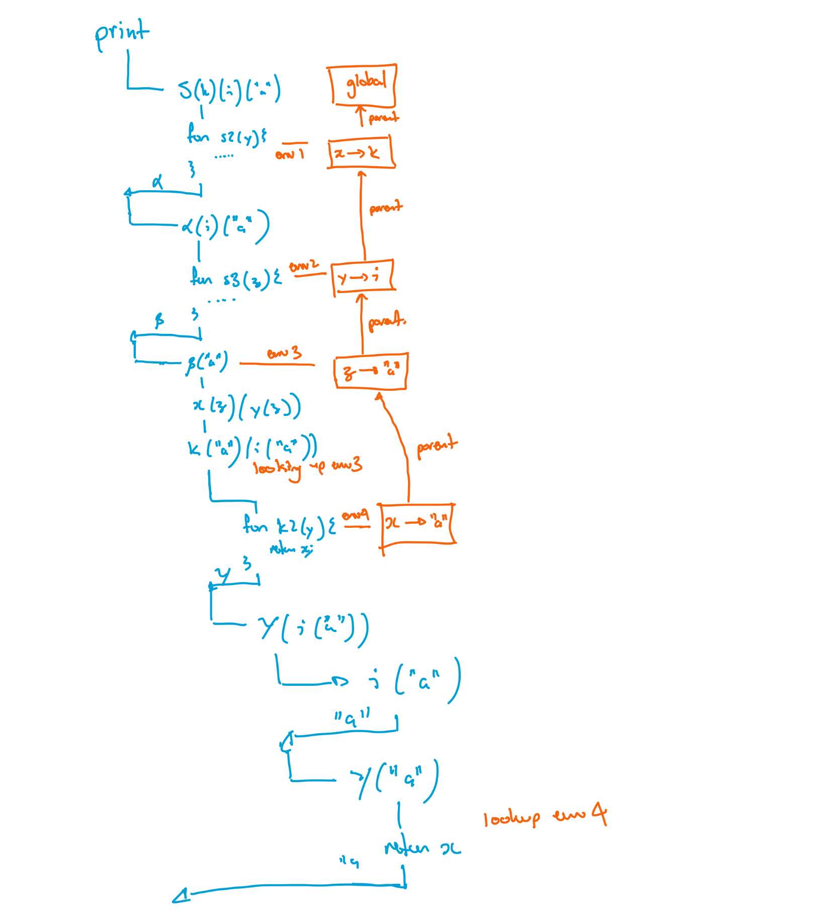

## Week Overview

This week we turn our focus to the machinery to define functions. This involves the environment in a substantial way so be sure you have that concept well set in your mind before embarking. 

## Goals

By the end of this week you should:

  * Understand the semantic meaning of a function definition and be able to explain it in precise terms.
  * Be able to add user-defined functions to Lox
  * Be able to generate programs that probe the edges of the semantics to find problems

## Preparation

Watch the echo360 videos:
  * parsing function definitions
  * how functions behave in the interpreter
  * tracing function calls
  * closures

# RAT

## what type of value a <gift>
What type of value is being returned by the `return` statement in the following code
```
fun foo()\{
  var i = 0;
  fun bar()\{
    i = i + 1;
  \}
  return bar();
\}
```
{
  =nil
  ~number
  ~uninterpreted function
  ~string
}

## what can be returned <gift>
What values can be returned with the `return` keyword in Lox?{
  ~numbers only
  ~numbers, booleans, and strings
  =numbers, booleans, strings, and uninterpreted functions
  ~booleans only
  ~uninterpreted functions only
}

## output of closure <gift>
What is the output of the following lox code?
`````
var i = 0;
fun makeCounter()\{
    var x = 0;
    fun count()\{
        x = x + 1;
        i = i + x;
        return i;
    \}
    return count;
\}
var c = makeCounter();
c();
c();
print(c());
`````
{
  ~0
  ~1
  ~2
  ~3
  ~4
  ~5
  =6
}

## output of closure <gift>
What is the output of the following lox code?
`````
fun i(x)\{
    return x;
\}
fun k(x)\{
    fun k2(y)\{
        return x;
    \}
    return k2;
\}
fun s(x)\{
    fun s2(y)\{
        fun s3(z)\{
            return x(z)(y(z));
        \}
        return s3;
    \}
    return s2;
\}
print(s(k)(i)(k("a")("b")));
`````
{
  =a
  ~b
  ~ab
  ~a b
  ~ba
  ~b a
}

# FAT

## assignment <essay>
question:|
  Work in your team on your assignment
answer:|
  none

# SSE

## block not statement? <essay>
question: |
    When we wrote the grammar for conditions and loops, the body was a `statement`, but here it is a `block`.  Why?  What would happen if it was done the other way?  Get your code base up to date and try out a grammar that uses `statement` instead.
answser: |
    Using `statement` supports single-statement bodies without curly braces. Who ever heard of a single-statement function without parenthesis?  Well Scala does, and other expression based languages.  You just are not used to it.

## understanding the LoxCallable call for function <essay>
question: |
  If you were lucky enough have one of us as a COMP1000 lecturer, we would have told you "parameter defiition is the same as varaible declaration and functions calls are parameter assignment".  How do these two paralellels show up in the Lox interpreter
answer: |
  Here is the interpreter code for visiting a variable declaration and assignment combined.
  ```
    Object value = null;
    if (stmt.initializer != null) {
      value = evaluate(stmt.initializer);
    }

    environment.define(stmt.name.lexeme, value);
  ```
  and here is the code we run to initialise each parameter in a function call
  ```
        environment.define(declaration.params.get(i).lexeme,
                           arguments.get(i)
                          );
  ```
  It is the same line of code!  The only difference is that when interpreting the variable assignment we had to evaluate the right-hand-side whereas in the function call, the actual parameters have already been visited and thus already evaluated for us.

## call stack <essay>
question: |
    There is a single return statement in the following code and it will only be evaluated once in the course of the program.  What is the state of the Java call stack just prior to the return being interpreted?
    `````
    fun foo(fst, snd){
      bar(snd, fst);
    }

    fun bar(fst, snd){
        print("first: " + fst + " second: " + snd);
    }

    foo("this one is first", "this one is second");
    `````
answer: |
    NB: I've drawn mine up-side down compared to the text
    ```
    Lox.main
    Lox.runFile
    Lox.run
    Interpreter.interpret
    Call.accept
    Visitor.visitCallStmt
    Function.call  // for foo    ---- try-catch here ----
    Interpreter.executeBlock
    Call.accept
    Visitor.visitCallStmt
    Function.call  // for bar    ---- try-catch here ----
    Interpreter.executeBlock
    Return.accespt
    Visitor.visitReturnStmt      ---- throw here ----
    ```
    It's fairly laborious doing this type of thing, but very helpful for understanding what is going on.  If I can do it, so can you.

## example of a local function <essay>
question: |
    Come up with your own example program that shows a local function being used.  If it is being used in a good way, all the better, but anything will do.
answer: |
    Local functions are great when you need to use local variables or they just are not needed anywhere else. For mine, I had fun "currying" some multi-argument functions
    `````
    fun i(x){
      return x;
    }

    fun k(x){
        fun k2(y){
            return x;
        }
        return k2;
    }

    fun s(x){
        fun s2(y){
            fun s3(z){
                return x(z)(y(z));
            }
            return s3;
        }
        return s2;
    }

    print(k("a")("b"));
    print(s(k)(i)("a"));
    `````
    For those interested, this is my lox implementation of the [SKI calculus](https://en.wikipedia.org/wiki/SKI_combinator_calculus)

## trace the ski <essay>
question: |
    Trace what is going on in the SKI example above when `s(k)(i)("a")` is run, include closures in your trace.
answer: |
    You should come up with your own notation, but notice the following features in mine

      * I can see each function call.
      * When a function call causes a function decleration, I show explicitly (in orange) the "closure" attached to that function declaration.
      * Because everything is staring from a single function call, everything is nested and all the old environments stay relevant.

    

# Exam

## what type of value b <gift>
What kind of value is being returned by the `return` statement in the following code
```
fun foo()\{
  var i = 0;
  fun bar()\{
    i = i + 1;
  \}
  return bar;
\}
```
{
  ~nil
  ~number
  =uninterpreted function
  ~string
}

## output of closure <gift>
What is the output of the following lox code?
<pre>
var i = 0;
fun makeCounter()\{
    var x = 0;
    fun count()\{
        x = x + 1;
        i = i + x;
        return x;
    \}
    return count;
\}
var c = makeCounter();
c();
c();
print(c());
</pre>
{
  ~0
  ~1
  ~2
  =3
  ~4
  ~5
  ~6
}

## output of closure 2 <gift>
What is the output of the following lox code?
<pre>
var i = 0;
fun object(i, j, k)\{
    var x = i;
    var y = j;
    var z = k;
    fun method()\{
        x = y * z;
        return x;
    \}
    return method;
\}
var o = object(1,2,3);
print(o());
</pre>
{
  ~0
  ~1
  ~2
  ~3
  ~4
  ~5
  =6
}


## output of closure 2 <gift>
What is the output of the following lox code?
<pre>
fun i(x)\{
    return x;
\}
fun k(x)\{
    fun k2(y)\{
        return y;
    \}
    return k2;
\}
fun s(x)\{
    fun s2(y)\{
        fun s3(z)\{
            return x(z)(y(z));
        \}
        return s3;
    \}
    return s2;
\}
print(s(k)(i)(k("a")("b")));
</pre>
{
  ~a
  =b
  ~ab
  ~a b
  ~ba
  ~b a
}
