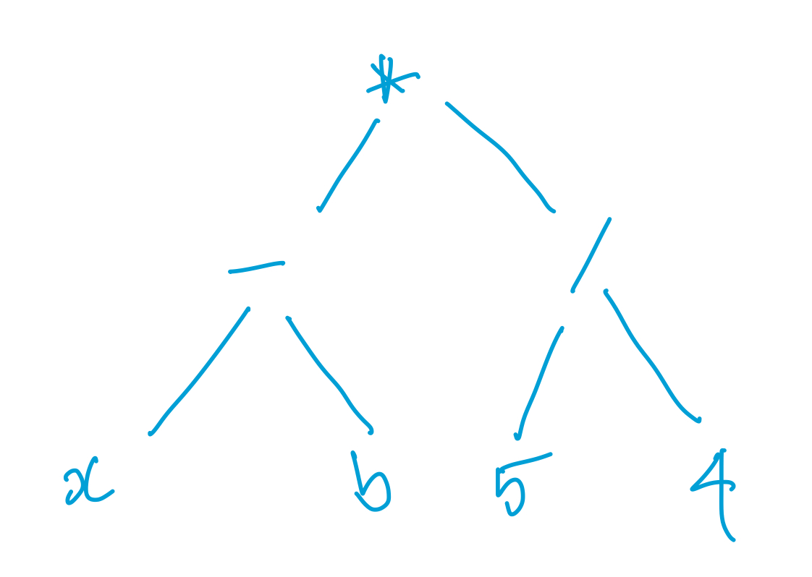
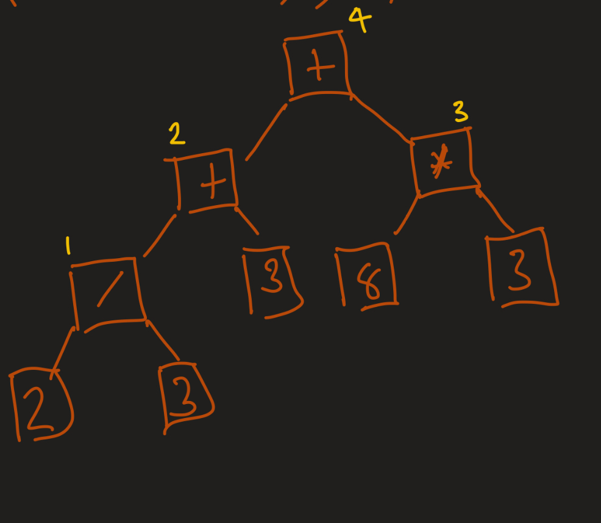
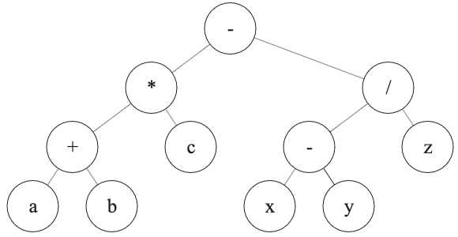
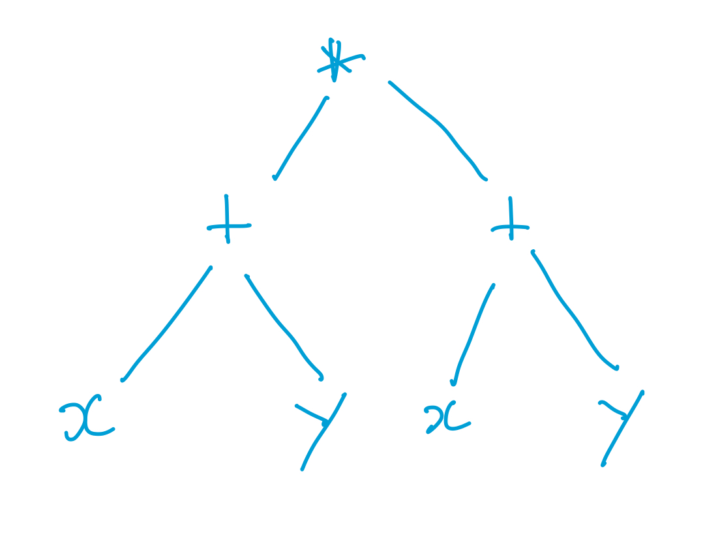
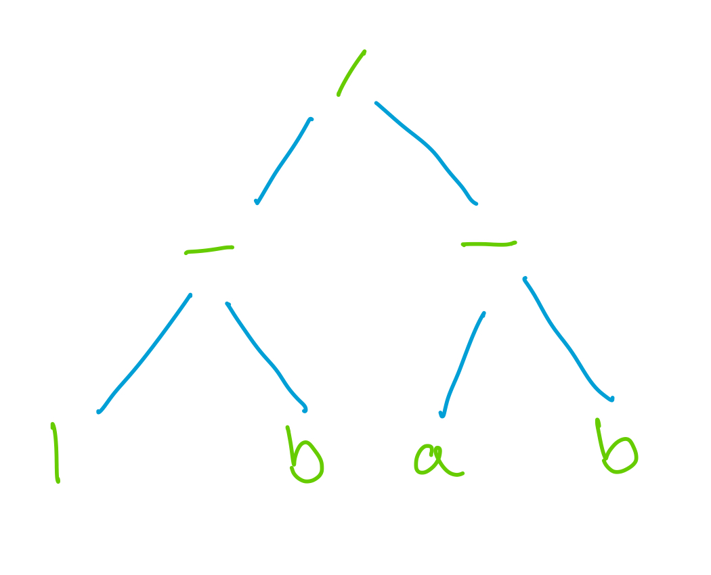
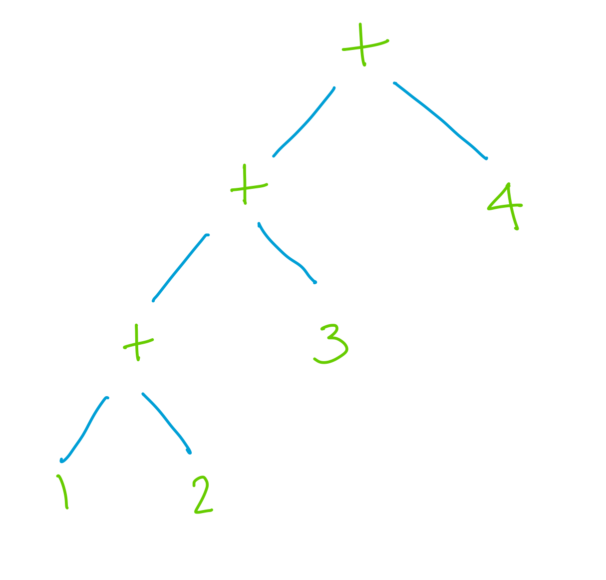

## Overview

This week we turn our focus to how the interpreter represents code internally.  We've seen tokens but the next data structure we move to is really important so we give it extra attention.  The structure is "abstract syntax trees" and they will become your best friend.

## Goals

By the end of this week you should:

    Start to appreciate that "evaluation is tree traversal"
    Learn how to write and read context free grammars
    Be able to generate a string from a context free grammar
    Be able to describe the syntax tree that results from a context free grammar

## Preparation
  * Read Chapter 5 of "Compiling Interpreters"
  * Follow along with the book by making adjustments to your own Lox interpreter
  * Watch the following lecture videos on echo360
    - Context free grammars
    - Nystrom's CFG notation
    - A CFG for lox _expressions_
    - Representing syntax trees

## Glossary
**composition**: If you can process the parts the combine them OR process the whole and still get the same result - you have something that _composes_.  This is a desirable property of any system.

**metaprogramming**: Metaprogramming plays a big roll this week and this is the first time we have ever seen it.  Metaprogramming is "a program that creates another program".  In our case, a Java program is creating another Java program for us.  If you think about it, we write a Java program, which we compile and run.  When we run it, it creates another Java program (as source code).  Now we have to compile and run that program!  Other phrases for this idea is staged compilation, macro programming, or reflection - though there are subtle differences between those terms.

# FAT

## Combining rivers into other rivers <tex-essay>
question: |
    This week we are seeing how arithmetic expressions can be seen as trees and how evaluating them is tree traversal.  We have also seen how that ties into writing a parser for arithmetic expressions.

    \begin{note}
    Your team probably began thinking about this last week when you were thinking about how to combine rivers.  Strictly speaking, we were focussing on how to represent a single river/watershed/catchement last week but that was hard to think about without thinking about combining rivers so I am sure many of you were on that track. This is the week where we \emph{really} get into the idea of combining them.
    \end{note}

    You have probably noticed that larger river systems get complex fast, so I have created a few smaller river systems we can use as example.  Figure \ref{fig:scouts} shows the Scout's creek area.  Figure \ref{fig:terrys} gives the Terry's creek area.  Figure \ref{fig:act_watershed} gives the Canberra area.

    \begin{figure}
    \includegraphics[width=0.588\textwidth]{src/6_simplified_act.jpg}
    \includegraphics[width=0.512\textwidth]{src/6_situated_act.jpg}
    \caption{An example watershed.  On the left is a stylised map and on the right is all the draining rivers and dams on a map to help situate the watershed.}
    \label{fig:act_watershed}
    \end{figure}

    In your application exercise this week your team will explore how the branching nature of watersheds leads to similar solutions when programming models of water flows.  If you have not read last week's application exercise, please do so.  The terminology from that exercise if assumed knowledge this week.  Last week's example water system is in figure \ref{fig:act_watershed} and two simpler ones have been added in Figures \ref{fig:scouts} and \ref{fig:devlins}.

    \begin{figure}
    \begin{minipage}{0.5\textwidth}
    \includegraphics[width=\textwidth]{src/6_imgs/scouts.jpeg}
    \caption{The Scout's Creek system}
    \label{fig:scouts}
    \end{minipage}
    \begin{minipage}{0.5\textwidth}
    \includegraphics[width=\textwidth]{src/6_imgs/devlins.jpeg}
    \caption{The Devlin's Creek system}
    \label{fig:devlins}
    \end{minipage}
    \end{figure}


    \subsubsection*{Example river flow literals}
    Before you can start this week's task, you need to have some answer for last week's task.  I've collected some of the literal forms that staff and students discussed that week for you to use as inspiration if you either struggled last week, or just if you like these better:
    \begin{description}
    \item[\texttt{2.0} or \texttt{2.0x} or \texttt{2.0L/s}]  This describes a watershed where every 1mm of rain creates a flow 2L/s in the river.  The number \verb+2.0+ or the multiplier \verb+2.0x+ or unit \verb+2.0L/s+ is used to show this.  This is a simple system with not much modelling power, but it works and it is a starting point.
    \item[\texttt{[1,3,3,2,1,0,0,0,0,0]}] This describes a watershed where 10L/s eventually gets into the river but on day 1 only 1L/s is in the river.  On day 2 3L/s gets into the river, and so on.  Standard list syntax has been used.
    \item[\texttt{R5}] This represents a watershed that eventually puts 5ML into the river for each mm of rainfall but does so with exponential decay.
    \item[\texttt{ED5}] This represents a watershed that puts 5L/s into the river on day 1 and that exponential decay is used to compute the amount on days 2-10.
    \item[\texttt(2.5 \textasciitilde 1)@10] This represents the same array as above, but described with a shorter syntax.  The 2.5 indicates which day has the most river flow and the 1 represents the size of the tail (in this case quite short).  The 10 indicates that the values all add to 10.
    \end{description}
    I would like you to see that \emph{there are multiple "correct" ways to approach this} and that there are \emph{multiple syntaxes you could choose} so your team will almost certainly have something unique!

    \subsubsection*{This week's task}
    Your task this week is to work out how something like a plus symbol allows you to describe the way rivers combine into other rivers.  

    Keep in mind that you are working towards an assignment submission based on this work and the more your team gets done in class, the easier your job is!  This week we would like you to create (and to show at the end of class)
    \begin{itemize}
    \item Expressions in your chosen notation/language which describe some example river systems.
    \item Be able to talk through the execution of those trees in theory
    \item A parser in Nystrom's CFG notation that extends Lox's parser to cover your language\footnote{if needed, or explain why the existing one from chapter 5 will work just fine}
    \end{itemize}

    
    \subsubsection*{Tips}
    You may well have everything you need within Lox's expression language.  If so, your task is to \emph{re-interpret} what those symbols mean in this context.  If not, your task is to come up with new symbols and to describe (in words, not code) what it means to \emph{execute} those symbols.


    Recall a few simplifying assumptions you can use to keep things workable (carried over from last week with three additions):
    \begin{itemize}
    \item The rainfall across a whole \emph{catchment} can be described with one number (in mm).
    \item The flow out of one creek is exactly the flow into the next creek.
    \item All water that gets into a creek/river will also flow out of it.
    \item All water that falls from the sky will (within 10 days) make its way into the creek/river.
    \item Each catchment has one creek/river which drains it.
    \item When rivers combine, their flow is combined by adding.
    \item A river's flow out is the sum of the flows in plus the water that falls in that watershed.
    \item There is no delay for water to flow through a river.  This one isn't realistic, but it helps simplify my system a lot.\footnote{I use $+$ for combining rivers.  If there was a delay, I would need to do something different for $a + b$ than I do for $b + a$, which doens't really match with how I think of $+$}
    \end{itemize}
    \newpage

answer: |
    \subsubsection*{Revision}
    So far I have looked at a few different literal forms for the flow in a river based on rainfall.  Note that some of the forms actually model different situations.  The simple forms can only model rain that drains into the river in one day.  The more complex forms can model rain which drains through the river over multiple days.  The fact that our choice of notation is related to our modelling power is a key insight.  Your team is free to pick a modelling strength that works for you.
    \begin{note}
    In all my approaches, I imagine that rainfall is measured in $mm$ and is somehow input into the running program.  I assume river flows are measured in $L/s$.  The way that rainfall is given to the running program is not specified, I just assume that there is a value out there somewhere that the runtime can use when it needs it.
    \end{note}
    \begin{description}
    \item[\texttt{4x}] My first suggestion was just a number with an x indicating that if `x mm` of rainfalls, that river gets `4x L/s` of water flow in it for that day.
    \item[$4\mathbb{R}$] This is the same as above, but it uses the $\mathbb{R}$ symbol to represent rainfall because I like that symbol.
    \item[\texttt{[1,3,3,2,1,0,0,0,0,0]}] This is a more powerful form which models the rain working its way into the river over 10 days.  $1L/s$ flows through river on day 1, $3L/s$ on day 2, etc.
    \item[\texttt{(1.5 $\sim$ 2)@10}] This is a shortened form of the list above.  It should be read "a list of numbers, the largest is at index 1.5 (i.e. indexes 1 and 2) and within 2 more days the values go to zero and where they all add up to a total of 10".  This is the kind of literal I suggested in my initial solution to the literal task which operated like a log normal distribution.
    \end{description}

    \subsubsection*{Main idea}
    The main thing to notice is that \emph{rivers combining works just like a plus would}.  For example, when the water from Maher's creek joins the water from Joe's creek, it creates a creek with the combined flow of both.

    Here is an answer for all the examples literals I added above for the Devlin's creek river system in figure \ref{fig:devlins}.  I've had to "estimate" the flows into the various bits of the creek and I chose to estimate them as

    \begin{tabular}{|p{0.2\textwidth}|p{0.1\textwidth}|p{0.1\textwidth}|p{0.3\textwidth}|p{0.2\textwidth}|}
    \hline
    Maher's creek & \texttt{4x} & \texttt{4R} & \texttt{[3,1,0,0,0,0,0,0,0,0]} & \texttt{(1 $\sim$ 1)@4} \\ \hline
    Joe's creek & \texttt{1x} & \texttt{1R} & \verb+[0.5,0.5,0,0,0,0,0,0,0,0]+ & \texttt{(1.5 $\sim$ 0)@1} \\ \hline
    The section from the confluence of Maher's creek and Joe's creek down to Devlin's Creek & \texttt{2x} &\texttt{2R } & \texttt{[2,0,0,0,0,0,0,0,0,0]} & \texttt{(1 $\sim$ 0)@2} \\ \hline
    The top of Devlin's creek & \texttt{8x} & \texttt{8R} & \texttt{[2,2,2,2,2,0,0,0,0,0]} & \texttt{(3 $\sim$ 2)@8} \\ \hline
    The output creek which is the bottom of Devlin's creek from where Maher's and Joe's join it & \texttt{4x} &\texttt{4R} & \texttt{[2,2,2,2,2,0,0,0,0,0] } & \texttt{(3 $\sim$ 2)@4} \\ \hline
    \end{tabular}

    With these I can work out the full flow in each of these sections of river.


    \begin{tabular}{|p{0.2\textwidth}|p{0.1\textwidth}|p{0.1\textwidth}|p{0.3\textwidth}|p{0.2\textwidth}|}
    \hline
    Maher's creek & \texttt{4x} & \texttt{4R} & \texttt{[3,1,0,0,0,0,0,0,0,0]} & \texttt{(1 $\sim$ 1)@4} \\ \hline
    Joe's creek & \texttt{1x} & \texttt{1R} & \verb+[0.5,0.5,0,0,0,0,0,0,0,0]+ & \texttt{(1.5 $\sim$ 0)@1} \\ \hline
    The section from the confluence of Maher's creek and Joe's creek down to Devlin's Creek & \texttt{2x + (4x + 1x)} &\texttt{2R + (4R + 1R)} & \texttt{[2,0,0,0,0,0,0,0,0,0] + ([3,1,0,0,0,0,0,0,0,0] + [0.5,0.5,0,0,0,0,0,0,0,0])} & \texttt{(1 $\sim$ 0)@2 + ((1 $\sim$  1)@ + (1.5 $\sim$  0)@1)} \\ \hline
    The top of Devlin's creek & \texttt{8x} & \texttt{8R} & \texttt{[2,2,2,2,2,0,0,0,0,0]} & \texttt{(3 $\sim$ 2)@8} \\ \hline
    The output creek which is the bottom of Devlin's creek from where Maher's and Joe's join it & \texttt{4x + (8x + (2x + (4x + 1x))} &\texttt{4R + (8R + (2R + (4R + 1R))} & \texttt{[2,2,2,2,2,0,0,0,0,0] + ([1,1,1,1,1,0,0,0,0,0] + ([2,0,0,0,0,0,0,0,0,0] + ([3,1,0,0,0,0,0,0,0,0] + [0.5,0.5,0,0,0,0,0,0,0,0]))} & \texttt{(3 $\sim$ 2)@4 + ((3 $\sim$ 2)@8 + (1 $\sim$ 0)@2 + ((1 $\sim$  1)@ + (1.5 $\sim$  0)@1)} \\ \hline
    \end{tabular}

    At this point we start to be very thankful for the \emph{neater} forms of literals.  The full list version is perhaps easy to understand, but very hard to work with.  The ability to "hide" complexity under a simple syntax is one of the reaons we \emph{love} using programming languages to model complex systems.

    \subsubsection*{Advanced thought}
    If all of the above is enough to make your head swim, skip this bit.

    In the examples above I used unecessary paranthesis.  I wrote  \texttt{(1 $\sim$ 0)@2 + ((1 $\sim$  1)@4 (1.5 $\sim$  0)@1)}  when  \texttt{(1 $\sim$ 0)@2 + (1 $\sim$  1)@4 (1.5 $\sim$  0)@1} would work just as well from a mathematical point of view.  \emph{But} when we use plus, we think of it as a "swappable"\footnote{"commutative" is the real term} operation.  We think of $A + B$ as the same as $B + A$.  We also think of it as "distributive", $(A + (B + C)$ is the same as $ (A + B) + C$  However, when we are thinking about plus for rivers, it does not have these properties. $(A + (B + C)$ represents rivers B and C combining first, then combining with A.  $(A + B) + C$ represents rivers A and B combining first, then combining with C.

    Depending on the calculations I end up doing \emph{this may or may not matter}, but it is interesting to think about at this point.  It also suggest a \emph{different} symbol than plus might be a good idea, one that doesn't have these overtones of commutivity and distributivity.

    In fact, I think \verb|->| or \verb|<-| would work really well for rivers combining into a new river, and I keep plus just for the confluence point of rivers.

    \begin{tabular}{|p{0.2\textwidth}|p{0.1\textwidth}|p{0.1\textwidth}|p{0.3\textwidth}|p{0.2\textwidth}|}
    \hline
    Maher's creek & \texttt{4x} & \texttt{4R} & \texttt{[3,1,0,0,0,0,0,0,0,0]} & \texttt{(1 $\sim$ 1)@4} \\ \hline
    Joe's creek & \texttt{1x} & \texttt{1R} & \verb+[0.5,0.5,0,0,0,0,0,0,0,0]+ & \texttt{(1.5 $\sim$ 0)@1} \\ \hline
    The section from the confluence of Maher's creek and Joe's creek down to Devlin's Creek & \texttt{2x <- (4x + 1x)} &\texttt{2R <- (4R + 1R)} & \texttt{[2,0,0,0,0,0,0,0,0,0] <- ([3,1,0,0,0,0,0,0,0,0] + [0.5,0.5,0,0,0,0,0,0,0,0])} & \texttt{(1 $\sim$ 0)@2 <- ((1 $\sim$  1)@ + (1.5 $\sim$  0)@1)} \\ \hline
    The top of Devlin's creek & \texttt{8x} & \texttt{8R} & \texttt{[2,2,2,2,2,0,0,0,0,0]} & \texttt{(3 $\sim$ 2)@8} \\ \hline
    The output creek which is the bottom of Devlin's creek from where Maher's and Joe's join it & \texttt{4x + (8x + (2x + (4x + 1x))} &\texttt{4R + (8R + (2R + (4R + 1R))} & \texttt{[2,2,2,2,2,0,0,0,0,0] <- ([1,1,1,1,1,0,0,0,0,0] <- ([2,0,0,0,0,0,0,0,0,0] + ([3,1,0,0,0,0,0,0,0,0] + [0.5,0.5,0,0,0,0,0,0,0,0]))} & \texttt{(3 $\sim$ 2)@4 <- ((3 $\sim$ 2)@8 <- ((1 $\sim$ 0)@2 + ((1 $\sim$  1)@ + (1.5 $\sim$  0)@1))} \\ \hline
    \end{tabular}

    By doing this, I am allowing my choice of symbols to better represent what is going on in my abstract syntax tree.  Balancing the choice of syntax to show \emph{just enough of the underlying structure} is the key to good language design.  There is no one right answer.

    A video companion to this explanation is available via iLearn.

# RAT

## Expression from tree four <gift>
Which lox expression corresponds to the following tree? .  {
  =(x-b)\*(5/4) 
  ~x-(b\*(5/4))
  ~((x-b)\*5)/4 
  ~(x-(b*5))/4
  }

## Terminals <gift>
In the following grammar, which symbols are "terminals"
`````
e -> t | f ;
t -> "foo" | "bar" ;
f -> "foo()" | "bar()" ;
`````
{
    ~e, t, and f
    ~e and t
    ~"foo" and "bar"
    ="foo", "bar", "foo()", and "bar()"
}

## Lexemes <gift>
Terminals are represented with a quoted string in the _metasyntax_.  Which of the concepts we've seen so far represent terminals in our interpreter?{
    =Tokens
    ~Characters
    ~Strings
    ~Trees
    ~Interpreters
    ~Compilers
    ~Grammars
}

## Simple grammar generation <gift>
Given the following grammar, which is a string that could be generated?
`````
a -> b | c ;
b -> "matt" d ;
c -> "damian" e ;
d -> "makes me sad" |  "broke my skateboard" | "ate my lunch" ;
e -> "is tops" | "is my favourite" ;
`````{
    ~"matt is tops"
    ~"damian broke my skateboard"
    ="damian is tops"
    ~"matt is damian"
    ~"damian is matt"
}

## GenerateAst Purpose <gift>
When generating the AST classes for our Lox interpreters, what is the purpose of writing a "tool" (e.g., `GenerateAst`)? {
    =To **automatically** generate the boilerplate code for AST node classes.
    ~To create a **high-performance engine** for interpreting the code.
    ~To improve **error handling** during the parsing phase.
    ~To reduce errors by allowing us to write more simpler code instead of less more complex code.
}

## Visitor Pattern Purpose <gift>
Why does Nystrom recommend using the visitor pattern for traversing AST nodes? {
    =To separate the **logic** for different operations (e.g., evaluation, printing) from the AST classes themselves.
    ~To reduce the **complexity** of defining each AST node as an independent class.
    ~To improve **performance** by making AST traversal faster.
    ~To allow operations to be added without modifying existing visitor classes.
}

# SSE

## Arithmetic as trees <essay>
question: |
  Consider the following arithmetic expression
  `````
  2 / 3 + 3 + (8 * 3)
  `````
  Draw a tree representation of the expression and evaluate it in the order you would do it in your head (following PEMDAS rules).  Label each part of the tree with a number indicating the order in which it would be evaluated.
answer: |
  <p></p>

## Trees as arithmetic <essay>
question: |
  Write the expression corresponding to the following tree (do not include spaces in your answer):
  <p></p>

answer: |
  `(a+b)*c-(x-y)/z`


## Expression from tree two <essay>
question: |
  Which lox expression corresponds to the following tree? 
  Note: the answer is a valid lox program, i.e. a string.
answer: |
  `````
  (x+y)*(x+y)
  `````

## Expression from tree three <essay>
question: |
  Which lox expression corresponds to the following tree? 
  Note: the answer is a valid lox program, i.e. a string.
answer: |
  `````
  (1-b)/(a-b)
  `````

## Tree from expression <essay>
question: |
  Draw the tree that should be generated from this expression according to PEMDAS rules.  This question is not asking about the Lox parser or any one grammar, it is asking about the rules we apply in arithmetic when evaluating this term.  You should draw some type of tree which represents the order of evaluation.  The expression in question is `1 + 2 + 3 + 4`
answer: |
  


## Generate from grammar <essay>
question: |
  Consider the following grammar
  `````
  program -> statement* ;
  statement -> "print " expression "; " | "$" NUMBER " = " expression "; " ;
  expression -> NUMBER | STRING | expression " + " experssion | expression " && " expression |"$"NUMBER;
  `````
  Generate three sentences in this grammar that are at least 30 characters long. Can you generate any nonsensical sentances with this grammar?  Side note: using "$" before variables is an old-school trick.
answer: |
  I generated the following

    * "$1 = 5; print $1; $2=$1; print $1 + $2;"
    * "$12 = 5678 && 3456 + $1 && $2; print $33433 && $77"
    * "print 5; print 5; print 5; print 5; print 5; print 5;"
  
  I couldn't come up with something I thought was completely nonsensical, even if I found it hard to guess what some of the strings might mean.

## Arithmetic terminals <essay>
question: |
  consider the arithmetic expression we did in the earlier question
  `````
  "  2 / 3 + 3 + (8 * 3)"
  `````
  If I told you this string was generated from a grammar:

    * would you believe me?
    * what would the terminals in the grammar be?
    * (optional) can you write out what you think the grammar was?

answer: |
  Yes of course, you wouldn't lie to me.  I think the terminals might be NUMBER, "+", "/", "*", "(", ")"
  I think the grammar might be
  `````
  A -> A "+" A | A "/" A | A "*" A | "(" A ")" | NUMBER
  `````

## Write a context free grammar <essay>
question: |
  Write a context free grammar that can recognise strings according to the following rules. Use a notation similar to the one used in the book so your marker can interpret what you are writing.

    * The string "wa " can appear as few as one time or as many as infite times
    * The string "wa " can never appear anywhere besides the start or after another "wa "
    * The string "nee " can only appear after a "wa" string
    * The string " grey" can only appear as the last thing.

  Example strings are:
    
    * "wa wa wa wa nee  grey"
    * "wa "
    * "wa  grey"
    * "wa nee  grey"
    * "wa  grey"
    * "wa wa "
answer: |
  This is a simple grammar in the end
  ```
  program = "wa "+ rem
  rem = ("" | "nee ") last
  last = ("" | " grey")
  ```
  There are plenty of other valid grammars, but this is mine.

## Writing a meta-program <essay>
question: |
  There is quite a lot going on in this meta-programming idea.  To ensure we have it straight in our head, we will make our own metaprogrammer for a simple task.
  Write a Java program which will generate a "Hello world" Java program.  Once you have done that, parameterise that function so it can generate hello world programs that output different text.  Have it generate 3 programs, one which outputs "hello_world", another that outputs "gday_mate" and a third that outputs "well_sod_ya_then".
answer: |
  Here is my program to create these programs.  I chose to put mine in a package called "meta" and that is where the generated programs will go to (but I will put them in a subpackage "generated").
  `````
  package meta;

  import java.util.List;
  import java.util.Arrays;
  import java.io.PrintWriter;
  import java.io.IOException;

  public class HelloThere {
      public static void main(String[] args) throws IOException {
          List<String> programs = Arrays.asList("hello_world", "gday_mate", "well_sod_ya_then");
          for (String greet: programs){
              generate("meta/generated/", greet);
          }
      }

      public static void generate(String path, String greet) throws IOException {
              PrintWriter writer = new PrintWriter(path+"Hello"+greet+".java", "UTF-8");
              writer.println("package meta.generated;");
              writer.println("public class Hello"+greet+"{");
              writer.println("  public static void main(String[] args){");
              writer.println("    System.out.println(\""+greet+"\");");
              writer.println("  }");
              writer.println("}");
              writer.close();
      }
  }
  `````

# Exam

## Expression AST <gift>
In the context of designing an AST for the expression "1 + 2 * 3", which of the following correctly represents the structure, assuming arithmetic operator precedence is respected? {
    = A root node "+" with a left child "1" and a right child "*" (whose children are "2" and "3").
    ~ A root node "*" with a left child "+" (whose children are "1" and "2") and a right child "3".
    ~ A flat structure with "+" at the root and "1", "2", and "3" as its children.
    ~ Three separate root nodes for "+", "*", and the literals "1", "2", and "3", with no hierarchy.
}

## Parser purpose <gift>
What is the role of the parser in generating an Abstract Syntax Tree (AST)? {
    = The parser analyzes the token sequence and organizes it into a hierarchical structure representing the code's syntax.
    ~ The parser converts the AST into executable machine code.
    ~ The parser uses the AST to perform runtime interpretation of the program.
    ~ The parser breaks the source code into tokens for lexical analysis.
}

## Representing Unary <gift>
Upon parsing a unary operator and it's operand such as "-a", what form of Abstract Syntax Tree? would fit best into the Lox interpreter described in "Crafting Interpreters"?{
    = A parent node labeled "-" with a single child node representing "a".
    ~ A parent node labeled "-" with two child nodes, both representing "a".
    ~ A single node containing the string "-a".
    ~ Two separate nodes: one for "-" and one for "a", with no parent-child relationship.
}