## Week Overview

This week we turn our focus to parsing for lox expressions.  Some of the things we left unsaid last week are resolved this week.

## Goals

By the end of this week you should:

  * Be able to locate and resolve ambiguity in grammars
  * Be able to write a recursive decent parser
  * Be able to parse lox expressions and add new lox expressions as you like.

## Preparation

  * Read Chapter 6 of "Crafting Interpreters"
  * Watch the lecture videos on echo360
      - Context for parsing and recap
      - Ambiguity in parsing
      - Implementing a parser
  * Catch up on old work, the first assignment is on its way!

**call frame**: We spoke about the call stack in an earlier week.  As your program is executed, more and more functions get called but not finished.  First the `main` method, then any function it calls, then any function that calls, etc.  Internally the runtime is keeping track of all these functions that are partially executed, in the call stack.  You can use a stack because the top one has to finish before going back one, etc.  Each "thing" on this stack is a "frame".  A "frame" is just all the bookeeping the run time needs for a function.  Most notably - any variables that function uses have to be in the frame.  Thus you end up building a little stack of useful information which can be "unwound" at the right time.  Exceptions are a way of popping multiple things of the stack in quick succession, rather than waiting for each return to happen.

# Assignment One

## Specification <tex-essay>
question: |
    Your task is to create
    \begin{itemize} 
    \item a Lox-style\footnote{Please don't start a custom parser/interpreter from scratch or use any language other than Java as your implementation language.  Your marker will need to be familiar with the basics of your approach - assume they are \emph{only} familiar with the Lox parser.} parser for programs simulating water flows, 
    \item three example programs, 
    \item and a document explaining your language and parser.
    \end{itemize}

    The document is your chance to explain your decisions and implementation to your marker, writing a good one will help your marker give you grades for the other files as well.  For example, your marker won't know how to compile your parser unless you tell them so you can't get parser marks unless you clearly describe that in your document.  If your intention is not clear from the documents you submit, you won't be allocated grades, even for work that is ultimately correct.  It is your responsibility to communicate clearly everything your marker needs in your submission.  Your marker will be one of the class teachers, so you can assume they are familiar with anything from class.

    \begin{note}
    There is ambiguity left in this description by design.  You are aiming to make \emph{the best possible domain specific language for waterflows} but we clarify a great deal to support grading your work.  Imagination is needed to complete this task and experimentation is strongly encouraged.
    \end{note}

    \subsubsection*{Table A}
    To get you started, 20\% of your marks are available just for completing the following table and including it in your document.  It will help your markers follow along with your explanations.

    \begin{tabular}{|p{0.5\textwidth}|p{0.3\textwidth}|}
    \hline
    What literal in your language represents a river that gets 10L/s of flow on the first day after 1mm of rainfall? & \\ \hline
    What symbol in your language is used to show two rivers combine? & \\ \hline
    Is the above symbol a "unary", "binary", or "literal"? & \\ \hline
    What folder is the "working folder" to compile your parser? & \\ \hline
    What command(s) will compile your parser? & \\ \hline
    In your language, how long does it take all the water to work through a river system after 1 day of rain? & \\ \hline
    Does your language include statements or is it an expression langauge? & \\ \hline
    Which chapter of the book have you used as the starting point for your solution? & \\ \hline
    \end{tabular}

    \subsubsection*{A parser for water flows}
    We wish to develop a domain specific language for the \emph{modelling} and \emph{simulation} of water flows in river systems.  A river system is a series of rivers.  Each river is either 
    \begin{enumerate}
    \item A root river or 
    \item The combination of the output of multiple other rivers or
    \item The last river in the system is identified as the \emph{output river}.
    \end{enumerate}
    A \emph{river system} is a series of connected rivers.  Your domain specific language must be capable of representing a river system.  Executing a program in this domain specific langauge (which we \emph{don't} do yet) will compute the flows in every river at each day given a certain rainfall.  For now  you can ignore the complication of representing the rainfall and focus on a language which is capable of describing the river itself.

    \subsubsection*{Example river system}

    You are free to build your examples from any real or imagined river system.  Here I have described one example river system which makes a relatively easy example to show off all the features of your language which you can choose to use.

    \begin{figure}
    \includegraphics[width=0.588\textwidth]{src/6_simplified_act.jpg}
    \includegraphics[width=0.512\textwidth]{src/6_situated_act.jpg}
    \caption{An example river system.  On the left is a stylised map and on the right is all the draining rivers and dams on a map to help situate the river system.}
    \label{fig:act_watershed}
    \end{figure}

    Figure \ref{fig:act_watershed} shows a river system situated near Canberra.   The following statements are true of this river system:
    \begin{itemize}
    \item The root rivers in this system are googong, jerrabombarra, and upper molongolo.  
    \item Googong drains to dam 1
    \item Dam 1 drains to queanbeyan
    \item Central molongolo is the combination of queanbeyan, upper molongolo, and jerrabombarra
    \item Central molongolo drains to dam 2
    \item Dam 2 drains to lower molongolo\footnote{FYI: Dam 2 dams lake Burly Griffith in Canberra, you may have been there!}
    \item The output of the entire river system is the output of lower molongolo
    \end{itemize}

    We make the following simplifying assumptions:
    \begin{enumerate}
    \item The rainfall across a whole \emph{river system} can be described with one number (in mm).
    \item The rainfall across the whole river system is provided at run time by "magic".  I.e. we can just assume for now that such a number exists and can be accessed.
    \item The flow into one river is the sum of the flows out of its feeding rivers.
    \item The flow out of a river is the flow in plus the water that has made it way into the river on that day.
    \item All water that gets into a river will also flow out of it.
    \item All water that falls from the sky will (within 10 days) make its way into the river.
    \item The outflow of a dam is exactly the inflow to the dam\footnote{We will relax this assumption later and have great fun controlling water flow with dams}.
    \item Rivers never split into two or more rivers.
    \end{enumerate}

    \subsubsection*{Use of Generative AI}
    An ability to use Generative AI is not a learning outcome of this course but GenAI is a tool you may choose to use along your journey.  If your submission is primarily AI generated, you will likely find yourself in the bottom of each rubric item.  Lox and Nystrom's notation are not well represented in AI training sets and Gen AIs are generally bad at language design.  We value, and give grades for, your contribution to the solution since it is you (not the GenAI vendor) who is earning the grade.

    \begin{note}
    You are free to use any and everything from your team's work on this task.  You may not use other team's work directly or solicit for solutions.  These remain contraventions of academic integrity.  The work of the team belongs to all team members, so they can submit that without contravening academic integrity.  However, this is your own submission.  You can, and should, improve upon your team's work as much as possible.  We have included a "similarity/creativity" score in the rubric so we can reward solutions that go beyond what was done in class.  Note that \emph{the document must be your own work}.  It can heavily reference the team's work, but you should write it from scratch yourself.

    You are also free to use any of the example solutions given by unit staff without referencing them.
    \end{note}
    \subsubsection*{Rubric}
    \begin{tabular}{|p{0.18\textwidth}|p{0.18\textwidth}|p{0.18\textwidth}|p{0.18\textwidth}|p{0.18\textwidth}|}
    \hline
    \textbf{Rubric item} & Fail (0) & Pass (50) & Credit (70) & Distinction (100) \\
    \hline
    Complete Table A (20\%) & None answers accurately & 2 or more answered accurately & 6 or more answered accurately & All answered accurately \\ \hline
    Grammar given in the document in Nystrom's notation (20\%) & No grammar or substantially broken grammar in the document & A grammar with small errors & A grammar that can model rivers systems & A grammar that can model river systems and an explanation of how each example program parses according the grammar \\ \hline
    Three example programs (20\%) & No program or the programs don't model river system correctly & Three programs of some form & \emph{pass} and the example programs all match the given grammar & \emph{credit} and the Lox-like parser can actually parse the programs \\ \hline
    Parser written in Java based on Lox codebase (20\%) & None or not in Java & Code is based on the Lox from chapter 6 of text & Code is based on the Lox from chapter 6 and your additions fit with the style & If there is any improvement to the Chapter 6 Lox code with an explanation in the document, you will get this grade. \\ \hline
    Uniquness and Creativity (20\%) & A direct submission of in-class work & minor modifications to in-class work & substantial improvement on in-class work & a unique submission showing creativity \\
    \hline
    \end{tabular}
    \subsubsection*{Examples for Uniqueness Rubric}
    Below I give total contribution tot he final assignment grade for certain scenarios:
    \begin{description}
    \item[0\%] You have been working with your team all semester and you take the solutions your team came up with, add \emph{your own} document and submit it as-is.
    \item[14\%]  You have been working with your team all semester and they also met outside class hour to try out other things. You take the solutions your team came up with, add \emph{your own} document and submit it as-is.
    \item[20\%]  You have been working with your team all semester. You take the solutions your team came up with and make some adjustments of your own to make it even better.  You add \emph{your own} document and submit.
    \item[20\%] You have been the main person doing all the work for your team and you submit that work, with a document of your own.
    \item
    \end{description}
    \newpage
answer: |
     Still to do

# FAT

## Parser for water flow expressions <essay>
question: |
    This week your team should try to write a parser for your water flow expressions from last week. If you didn't get one working, take a look at last week's guidance/solution which will give you a starting point.

    You will need to consider if there is any ambiguity in your grammar.  If there is, you need to adjust your grammar to remove it.

    With that done you should implement it.  _Implementing_ it means replicating chapter 6 of the "Crafting Interpreters" text for your language insted of Lox.  Your language should pretty much just be Lox with an extra literal and maybe an extra operation so for most of you that will mean taking the code from the text book and adjusting it to work for your waterflow language instead.

    The description of the application exercise is nice and short this week, but it is quite a lot of work.  It is work that builds on the assumption that at least one person in your team is up to date with:

      * Following along with the text book and having a working Lox expression parser which you can start with.
      * Being comfortable with what we mean when we say we are only working with Lox expressions at the moment.
      * Being comfortable with Nystrom's Context Free Grammar notation
      * Understanding last week's exercise and completing it.

    If this is not true of your team, it is best to back up and do those things instead of pushing forward.  It is always best to build on a solid foundation!

    Note that we \emph{did not try to make a grammar for our langauge in last-week's application exercise}. The normal course of things is to:
    \begin{enumerate}
    \item Explore expression forms (which we did do last week)
    \item Create an on-paper grammar (which we have not done yet)
    \item Program that grammer in Java (which is this week's task).
    \end{enumerate}

    Make sure you create the on-paper grammer in Nystrom's notation before attempting to implmenting it!  It is absolutely OK if your team only gets to the on-paper grammar this week.
    \newpage

answer: |
    I am going to do \emph{two} versions of my language so you can see possible approaches.  I will do two of the versions from my solutions last week. I will do the \verb|4R + 2.2R| language which assumes all rain flows out the river on the one day (lets call it "simple-river") and the \verb|[2 ~ 1]@4 <- ([2 ~ 2]@2.2 + [1 ~ 0]@4)| language which models rain taking time to get into the river and includes the direction of water flow (lets call it "complex-river").  For this week we don't even really need to understand the meaning of those forms, we only need to parse them.

    \subsubsection*{Simple-River}
    Simple-river has a single new token which my scanner must be scanning for me.  In my solution it scanned it into a \verb|FLOW| token, which is separate from a \verb|NUMBER| token.  The only other tokens I need are \verb|PLUS|, \verb|LEFT-PAREN|, and \verb|RIGHT-PAREN|

    \begin{note}
    Since I am working from chapter 6 lox, it is simplest for me just to leave the rest of the scanner untouched, I will probably use those tokens later
    \end{note}

    The grammar for simple-river is very small and looks like this

    \begin{verbatim}
    expression -> mini_term (PLUS mini_term)*;
    mini_term -> FLOW | "(" expression ")";
    \end{verbatim}

    That is \emph{all I need} to parse my example programs!  Ignoring the changes in the scanner (you can see the accompanying video for those), I only need to have the right methods in my parser to express these two forms.  I have taken the full chapter 6 parser and simply redifined the top function \verb+expression+ and added one for my special mini terms (just to allow me to keep the \verb|term| function that is already there in case I want to use it later)

    \begin{verbatim}
    private Expr expression(){
      Expr expr = mini_term();
      while(match(PLUS)){
          Token operator = previous();
          Expr right = mini_term();
          expr = new Expr.Binary(expr, operator, right);
      }
      return expr;
    }

    private Expr mini_term(){
      if (match(FLOW)){
          return new Expr.Flow(previous().literal);
      } else {
          if (match(LEFT_PAREN)){
              Expr expr = expression();
              consume(RIGHT_PAREN, "Expect ')' after expression.");
              return new Expr.Grouping(expr);
          }
      }
      throw error(peek(), "Expect expression.");
    }
    \end{verbatim}

    \subsubsection*{Complex-River}
    Expressions in complex river are more complex, but the bulk of the work is done in the scanner (you can see that done in the accompanying vid).  The example expression above

    \begin{verbatim}
    [2 ~ 1]@4 <- ([2 ~ 2]@2.2 + [1 ~ 0]@4)
    \end{verbatim}

    scans as

    \begin{verbatim}
    [LEFT_SQUARE, NUMBER, TILDE, NUMBER, RIGHT_SQUARE, AT, NUMBER, LEFT_ARROW, LEFT_PAREN...
    \end{verbatim}
    
    The grammar to describe complex-river is very much like simple-river but requires a new non-terminal for flows since they are too complex to be grabbed by the scanner.

    \begin{verbatim}
    expression = mini_term (op mini_term)*;
    op = PLUS | LEFT_ARROW;
    mini_term = flow | "(" expression ")";
    flow = "[" NUMBER "~" NUMBER "]" "@" NUMBER;
    \end{verbatim}

    The Java code to parse this is 

    \begin{verbatim}
    private Expr expression(){
      Expr expr = mini_term();
      while(match(PLUS, LEFT_ARROW)){
          Token operator = previous();
          Expr right = mini_term();
          expr = new Expr.Binary(expr, operator, right);
      }
      return expr;
    }

    private Expr mini_term(){
      if (match(LEFT_PAREN)){
          Expr expr = expression();
          consume(RIGHT_PAREN, "Expect ')' after expression.");
          return new Expr.Grouping(expr);
      } else {
          return flow();
      }
    }

    private Expr flow(){
      if (match(LEFT_SQUARE)){
          Object mean = consume(NUMBER, "Expect mean after '['.").literal;
          consume(TILDE, "Expect '~' after mean.");
          Object variance = consume(NUMBER, "Expect variance after '~'.").literal;
          consume(RIGHT_SQUARE, "Expect ']' after variance.");
          consume(AT, "Expect '@' after ']'.");
          Object magnitude = consume(NUMBER, "Expect magnitude after '@'.").literal;
          return (new Expr.Flow(mean, variance, magnitude));
      }
      throw error(peek(), "Expect flow expression.");
    }
    \end{verbatim}

    Note here that I had to create a whole new AST node to store \verb+FLOW+s.  They don't fit with \verb|Binary| or \verb+Literal+ or any of the AST nodes I already had.  Here is the part of \verb+AstGenerator.java+ I had to modify to achieve this\footnote{and don't forget to recompile and re-run the generator!}

    \begin{verbatim}
        
    defineAst(outputDir, "Expr", Arrays.asList(
      "Binary   : Expr left, Token operator, Expr right",
      "Grouping : Expr expression",
      "Literal  : Object value",
      "Flow     : Object mean, Object variance, Object magnitude",
      "Unary    : Token operator, Expr right"
    ));
    \end{verbatim}

    and I added a new visitor to the ASTPrinter as required.

    \begin{verbatim}
    @Override
    public String visitFlowExpr(Expr.Flow expr) {
        if (expr.mean == null
        && expr.variance == null 
        && expr.magnitude == null) return "broken flow was parsed"; // super hacky :)
        return "[" + expr.mean.toString() + 
            "~" + expr.variance.toString() + 
            "]@" + expr.magnitude.toString();
    }
    \end{verbatim}


# RAT

## Cobbled <gift>
The text notes that ". Many of us have cobbled together a mishmash of regular expressions and substring operations to extract some sense out of a pile of text."  When have you done this?{
    =An earlier application exercise!
    ~I never have
}

## play <gift>
We can "play" a context free grammar to generate valid strings, a parser will run that process ....{
    =in reverse
    ~infinitely
    ~in now way at all
    ~recursively
}

## associativiy <gift>
Which of the following grammars will parse `1 + 2 - 3` in a left-associative manner?
Grammar 1
---------
```
primary -> NUMBER | STRING
factor -> factor ("+" | "-") primary
       |  primary
```
Grammar 2
---------
```
primary -> NUMBER | STRING
factor -> primary ("+" | "-") factor
       |  primary
```
Grammar 3
---------
```
primary -> NUMBER | STRING
factor -> primary (("+" | "-") primary)*
       |  primary
```
{
    ~Grammar 1 only
    ~Grammar 2 only
    ~Grammar 3 only
    ~Grammars 1 and 2
    =Grammars 1 and 3
    ~Grammars 2 and 3
}

### which is ambiguous <gift>
Which of these two grammars is ambiguous?
```
Grammar 1
---------
top -> expr
expr -> expr op expr
     |  prim
op -> "+" | "-"
prim -> "1" | "2" | "3" | "4" | "5" | "6" | "7"
---------
Grammar 2
---------
top -> expr
expr -> expr op prim
     |  prim
op -> "+" | "-"
prim -> "1" | "2" | "3" | "4" | "5" | "6" | "7"
```
{
    ~Grammar 1 only
    =Grammar 2 only
    ~Both Grammar 1 and Grammar 2
    ~Neither Grammar 1 nor Grammar 2
}


## which derivation <gift>
Which of the following is a derivation of the string `"Hi Bye Bob "` according to this grammar
```
top -> thing*
greet -> "Hi " greet
      |  "Bye " greet
      |  person
person -> "Bob " | "Pete "
```
{
    ~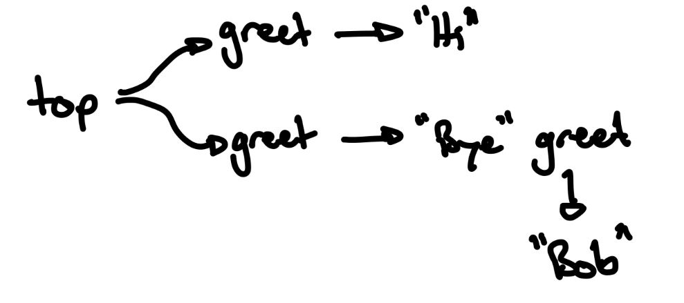
    ~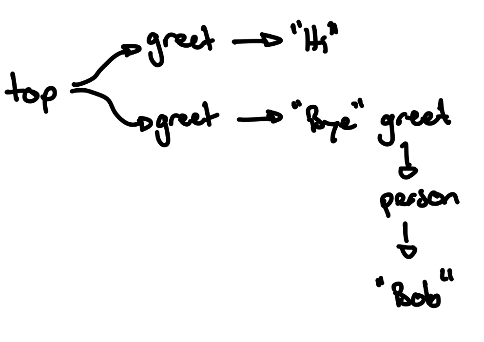
    ~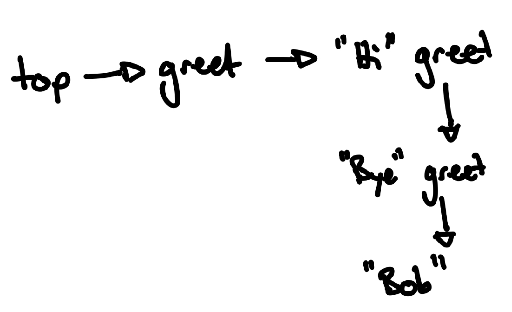
    =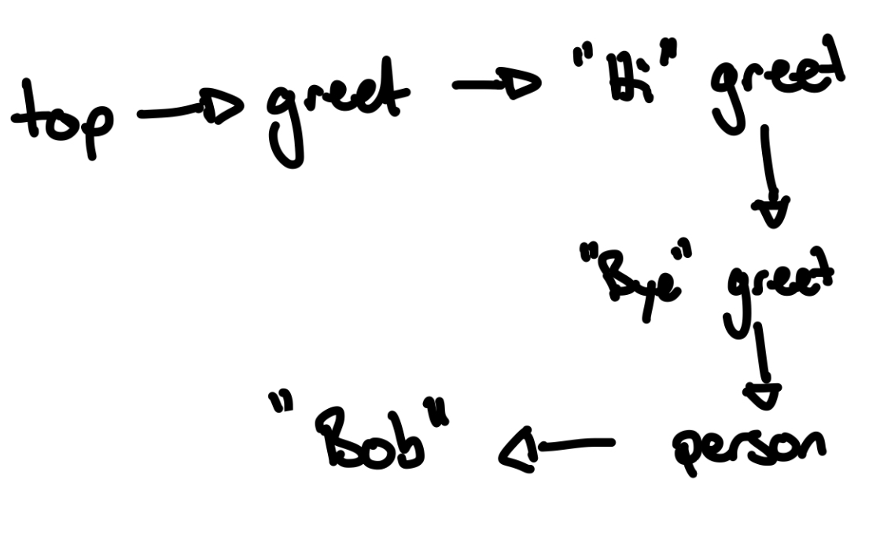
}


# SSE

### example <essay>
question: |
    Consider the following lox code which could have been generated by the grammar in chapter 5 of the text
    ```
    5 + 4 * 3
    ```
    The grammar in question is
    ```
    expression     → literal
                   | unary
                   | binary
                   | grouping ;

    literal        → NUMBER | STRING | "true" | "false" | "nil" ;
    grouping       → "(" expression ")" ;
    unary          → ( "-" | "!" ) expression ;
    binary         → expression operator expression ;
    operator       → "==" | "!=" | "<" | "<=" | ">" | ">="
                   | "+"  | "-"  | "*" | "/" ;
    ```
    
    There are two ways to generate this string with the grammar in question.  Find and describe both.  One of them is right, which one?  How do you know?
answer: |
    One way is
    ```
    binary -> expression -> binary -> expression -> literal -> NUMBER "5"
                                   -> operator   -> "+"
                                   -> expression -> literal -> NUMBER "4"
              operator   -> "*"
              expression ->  literal -> NUMBER "3"
    ```
    Another way is
    ```
    binary -> expression  -> NUMBER "5"
           -> operator   -> "+"
           -> expression -> binary -> expression ->  literal -> NUMBER "4"
                                      operator   -> "*"
                                      expression ->  literal -> NUMBER "3"
    ```
    The grammar does not tell us which is correct, we have to add in our own interpretation to make a decision.  Because we want arithmetic to work in lox the same way it does in the real world (* has precedence over +), it is the second that is "correct".

## Find the left recursion <essay>
question: |
    Explore how the following grammars operate for the expression `1 + 2 - 3 + 4`.  
    Grammar 1 (left recursive)
    ```
    primary -> NUMBER | STRING
    factor -> factor ("+" | "-") primary
            | primary
    ```
    Grammar 2 (right recursive)
    ```
    primary -> NUMBER | STRING
    factor -> primary ("+" | "-") factor
            | primary
    ```
    Grammar 3 (non-recursive)
    ```
    primary -> NUMBER | STRING
    factor -> primary ("+" | "-") primary
            | primary
    ```
answer: |
    To explore these, I will try out different derivations to see if I can generate them from the parser.  I'm going to start with Grammar 3 because I already know that one will be problematic.
    
    Grammar 3
    ---------
    If I try to generate my string, I can't start with `primary` because that can only ever lead to one number or one string, so I try `factor`
    ```
    factor -> primary
              ("+" | "-")
              primary
    ```
    From here I have limited choices~  The two `primary`s can become numbers and the operator can be a plus or a minus but this leaves me stuck at `1 + 2` or `2 - 3` or `3 + 4`.  I can't generate the longer expression with this grammar.  Without some sort of recursion, I can't create the infinitely long expressions that maths allows for and where associativity starts to "kick in".
    
    Grammar 1
    ---------
    Following grammar 1, there is only one way to generate the string because the factor sits on the left meaning that is the only place a more complex sub part can go.  We have to peel off numbers from the right
    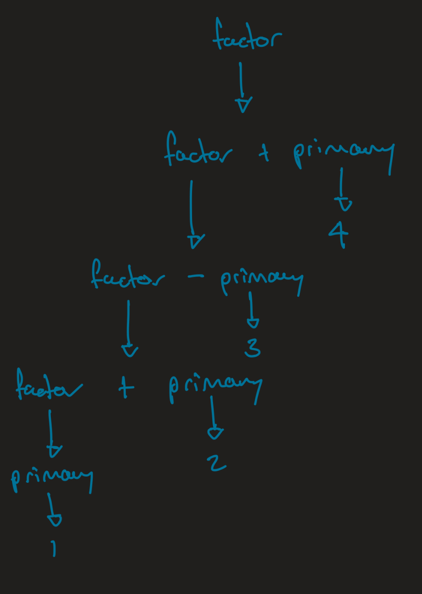
    This is the correct way because the `1 + 2` happens first (even though it is down the bottom of this tree), and the others follow in the left-associative way we expect.

    Grammar 2
    ---------
    Also only has one possible derivation (i.e. is unambiguous) but generates a different tree.  This one generates the tree for the right-associative operators.  We don't want right-associative because that's not how we think of maths as working.
    
    Be sure you take the time to convince yourself of why each tree represents the version we say they do, it is too easy to slip over this not really understanding it.

## write a grammar <essay>
question: |
    Convert the following grammar to one with no ambiguity.  The operations `&`, `|` should have higher precedence than `==` and `!=`.  All operators should be right-associative.
    ```
    boolean -> boolean ("&" | "|" | "==" | "!=") boolean
            | "TRUE"
            | "FALSE"
    ```
answer: |
    ```
    boolean -> boolean ("==" | "!=") factor
    factor -> factor ("&" | "|") primary
    primary -> "TRUE" | "FALSE"
    ```
    Another valid answer is
    `````
    boolean -> (factor ("" | ""))* factor
    factor -> (primary ("" | ""))* primary
    primary -> "TRUE" | "FALSE"
    `````
    Note: the fact that sequences this way ends up with the associativity we want is specific to the lox parser, but that is our world, so we will accept it.

## What lox parser produces <essay>
question: |
    Draw (using pen and paper) the ASTs that result from the Lox parser parsing the following expressions:
    
      * `1`
      * `1 + 2`
      * `1 + 2 + 3`
answer: |
    It is important to start by fully understanding the AST we have to work with.  Recall that this was generated by our meta-program but we can go look at what was generated.
    
      * `Expr`
      * `Expr.Binary`
      * `Expr.Grouping`
      * `Expr.Literal`
      * `Expr.Unary`

    So the parser can only generate these types of values.  `Expr.Binary`,`Expr.Grouping`, and `Expr.Unary` contain other expressions, so we can end up with a tree of nodes (depending on the starting expression) but if we are generating for just a literal, it will just be one node.  I'm going to use a UML-ish notation and fill in the fields for each object in my diagrams.
    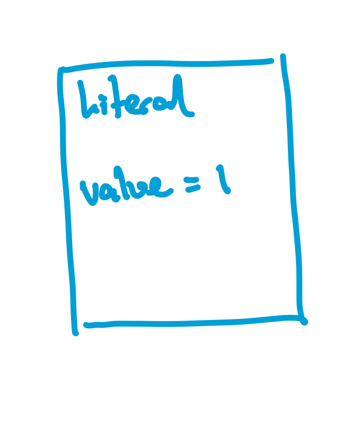
    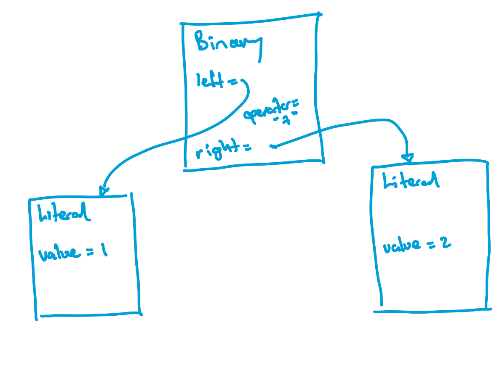
    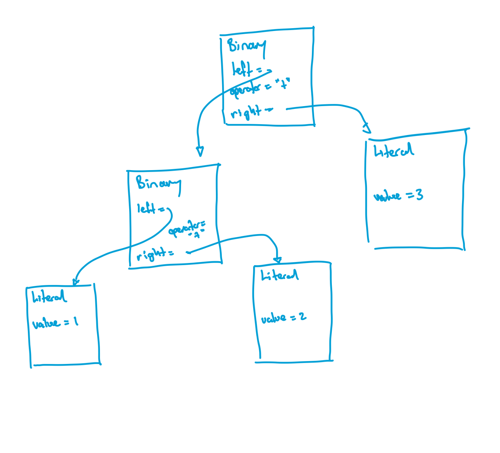

## adding a new type of literal <essay>
question: |
    As it stands, lox has only numbers, strings and booleans (plus nil).  Lets add a new kind of data to the language, one that might need some tricky scanning/parsing!  Lets add _symbols_ - the kind Ruby has.  A symbol begins with a colon and after that is an identifier.  We would fill out the semantics of symbols later but for now you should allow them to appear in any place that other literals like `NUMBER`, `STRING`, `"true"`, `"false"` or `"nil"` appear.  Here is an example lox program using symbols.  Note that we only have a parser for _expressions_ at the moment, so my example doesn't include the symbol declaration part, we would deal with that that later.
    `````
    (1 + 3) * :numberof;
    `````
answer: |
    I'm going to need to touch a few places in my language.  The scanner needs to know about this so I add a new `TokenType` and update `Scanner`.
    ```
    SYMBOL,
    ```
    We need a place in our scanner switch to find the symbol and a function to injext them
    ```
    // string literals
    case '"': string(); break;
    case ':': symbol(); break;
    default : 

    ...

    private void symbol() {
      while (isAlphaNumeric(peek())) advance();
      String ident = source.substring(start+1, current);
      addToken(SYMBOL, ident);
    }
    ```
    We are finally ready to think about how this appears in our parser!  Turns out to be very simple, it is just he same as any other literal. So `primary` gets updated in our grammar and we use this to guide our code changes
    ```

    ```
    and that makes is clear we have a very simple code change
    ```
    if (match(NUMBER, STRING, SYMBOL)) {
      return new Expr.Literal(previous().literal);
    }
    ```
    This works, and I will leave it here for now.  _However_ - you should note carefully what is happening in your output.  There is no way to tell strings from symbols anymore.  We treat all literals as simple values and the value of a symbol is the same as the value of a string.  _Draw out the AST you are getting from certain expressions to see what I mean_.

# Exam

## which works <gift>
Which of the following grammars will parse `1 + 2 - 3` in a left-associative manner?
Grammar 1
---------
```
primary -> NUMBER | STRING
factor -> factor ("+" | "-") primary
```
Grammar 2
---------
```
primary -> NUMBER | STRING
factor -> primary ("+" | "-") factor
```
Grammar 3
---------
```
primary -> NUMBER | STRING
factor -> primary ("+" | "-") primary
```
{
    =Grammar 1 only
    ~Grammar 2 only
    ~Grammar 3 only
    ~Grammars 1 and 2
    ~Grammars 1 and 3
    ~Grammars 2 and 3
}

## which statement for grammar a <gift>
Which statement is _most_ true of the following grammar?
```
top -> expr
expr -> expr op prim
     |  prim
op -> "+" | "-"
prim -> "1" | "2" | "3" | "4" | "5" | "6" | "7"
```
{
    ~It is ambiguous
    =It is left-associative
    ~It is right associative
    ~It is non-associative
}

## definitions <gift>
Match the term to the definition of that term{
    =precedence -> determines which operator is evaluated first when there is a mix of operators
    =associativity -> determines which operator is evaluated first when the same operator appears in one expression
    =parenthesis -> sets order explicitly
    =non-associative -> operators you can't use in a place where associativity is needed to resolve ambiguity
}

## which derivation two <gift>
Which of the following is a derivation of the string `"Hi Bob Bye Bob "` according to this grammar
```
top -> thing*
greet -> "Hi " greet
      |  "Bye " greet
      |  person
person -> "Bob " | "Pete"
```
{
    =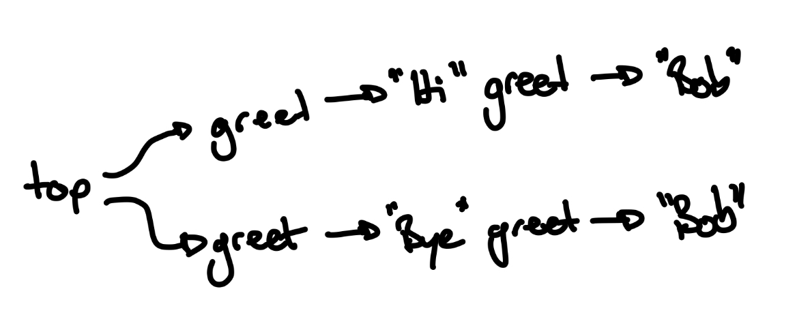
    ~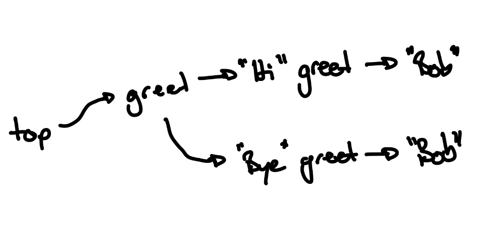
    ~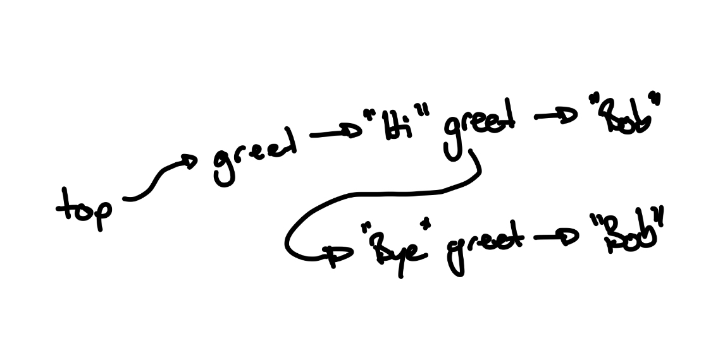
    ~
}
