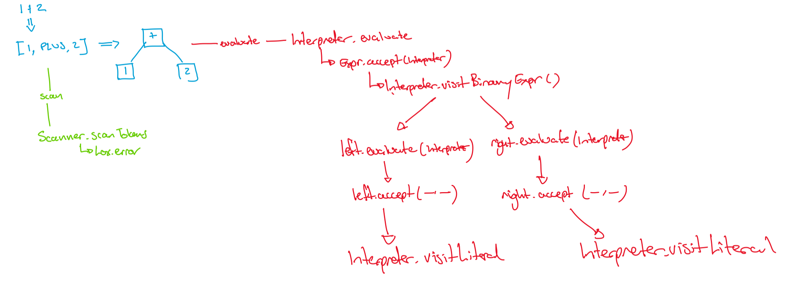

## Week Overview

This week we turn our focus to evaluating expressions using tree walking.

## Goals

By the end of this week you should:

  * Explain the difference between values and expressions
  * Evaluate Lox expression and write a Lox evaluator as a Visitor

## Preparation
  * Read chapter 7 of "Crafting Interpreters"
  * Watch the following echo360 Videos
    - Recap and context for evaluation
    - A quick description of each accept method
    - Details of the evaluation visitor

**values vs computation**: Computing never escapes the duality of code and data.  Your computer memory has code mixed with data.  Up to now we have separated _expressions_ from _statements_ (statements are code only, expressions are data that might need computing).  We will now talk more about _values_ vs _computation_.  

**declarative**: A _declarative_ programming language is one in which you only say _what to do_ not _how to do it_.

**boxed types**: in languages like Java the system offers both reference types (objects) and value types (primitive types). Each of the value types that Java supports is complemented by a reference type that contains a read-only copy of the value represented inside an object. This provides a reference so as to allow the use of all the facilities provided by the Java API with these values.

# RAT

## why <gift>
In creating Lox, we built special classes for Tokens and Abstract Syntax Tree nodes, but we did not do the same for _values_.  Which of following is the best explanation for why we didn't{
    =The built-in `Object` worked well for the task.
    ~The built-in primitive types worked well for task.
    ~There is no difference between Java and Lox at the value level.
    ~We didn't know how to yet.
}

## not true <gift>
Which of the following  _not true_  of the relationship between expressions and values{
    ~expressions are AST nodes that become values when evaluated
    ~all expressions can have a value
    =all expressions are also values at all times
    ~the parser creates expressions, the interpreter creates values
}

## structure <gift>
Which of the following most accurately describes how the evaluator is structured?{
    ~We have an object with one method that can evaluate any AST node
    ~We have an interface from which each AST node evaluator is inherited
    =We have one object for evaluating which has different methods chosen by overriding
    ~We have an object with methods chosen by overloading
    ~We have an interface from which each overloaded method is chosen.
}

## evaluation order <gift>
When evaluating unary operators (e.g., `-` or `!`) in an interpreter, which of the following steps is typically required?
{
~ Convert the operand into a string before applying the operator.
= Evaluate the operand first, then apply the operator to the result.
~ Skip evaluation of the operand and directly apply the operator to the raw syntax.
~ Apply the operator without considering the type of the operand.
}

## Assignment grade 1 <gift>
Consider the following description of an assignment one submission: "The student was in a productive group who worked out exactly what an expression should look like for river flows.  The student did their own Lox-like parser for that expression language and created 2 example programs in it.  They submitted the work with a document showing how to compile and run but without any explanation of how the language works.  The parser worked perfectly on the example programs.  The student forgot to include table A."  What grade would you expect them to receive according to the rubric?{
    ~0
    ~20
    ~40
    =60
    ~80
    ~100
}

# FAT

## Evaluating expressions <tex-essay>
question: |
    At this point, from earlier weeks, you should have some example expressions in your water flow languages.  My expression for the Canberra area looks like:

    \begin{lstlisting}
    (3~4)@4+ (1~1)@10 + (1~0)@1 + (5~5)@2 + (4~5)@2 + (2~2)@3 + (1~0)@7 + (2~2)@2
    \end{lstlisting}
    
    It is quite unlikely you came up with the same language, so it probably makes little sense, but you should be able to break that example into an abstract syntax tree which is pretty accurate just based on what we have seen so far\footnote{And I encourage you to try, just for fun.}

    Your team's task this week is to write your Tree Walking Evaluator for \emph{your} team's expression language from last week.  You should feel free to make any adjustments to your expression language along the way - nothing is set in stone!

    At the end of class we hope you will be able to demonstrate your evaluator running to the class.

    \subsubsection*{The input?}
    One key question is "what is the input that the program runs on?"  My expression above assumes there is a rainfall history floating around that the executor can work on.  I chose to hard code the rainfall into my evaluator.  As evaluation progresses, the visitor itself has a rainfall history it can call on to compute the final \emph{value} which is emmitted from the program.  There are lots of other options and your team is free to use any they want.  A few sensible ones are:
    \begin{itemize}
    \item Hard code into the interpreter (as I have)
    \item Pull from the internet during run-time (most advanced approcah)
    \item Pass in on the command line
    \item Grab from an environment variable
    \end{itemize}

    \subsubsection*{The output}
    What will the output of the program be?  In Lox, we return a success code \emph{and} run any of the print commands.  We might not have print commands, will the program just silently run?  The whole point of this program is to work out the flow in the output river, so you should hard code your evaluator to print this value at the end of execution, whatever that value is.
    \newpage
answer: |
    Still to come

# SSE

## value vs expression <essay>
question: |
    Based on what you understand an _expression_ and a _value_ to be, write one sentence that explains the difference in the most pithy way you can.
answer: |
    A _value_ is an _expression_ that has been _evaluated_ as far as possible.

## alternatives to objects <essay>
question: |
    In Lox, the `Object` type is used to store values.  Describe an alternative approach that could also work.  Your answer should include an explanation of _why_ that would work and _how_ that would work.
answer: |
    We could use primitive types. To make this work would require different evaluation functions based on the type of the expression being evaluated and this would also require some more analysis on the parse tree to work this out before trying to evaluate.

## do a trace <essay>
question: |
    Learning how to trace an execution is an important skill.  Everyone will have a different way of doing it, find your own style.  
    
    Do a trace of these Lox expressions:
    
      * `1 + "hi"`
      * `true && false || true`
      * `5 - false`
    
    You can use your own notation and style of the trace but you should end up with some diagram you can upload as your answer to this question.
answer: |
    No answer provided here because each class will come up with their own preferred answer.  When you are doing your own trace, you should use your own notation and include the information that matters to _you_.

## refactor and justify your improvement <essay>
question: |
    Nystrom's code is wonderful, but it can be improved.  Specifically in `Interpreter.java`, perform some refactoring that you think is an improvement and justify your choice.
answer: |
    I see two.  One is to use pattern matching instead of `instanceof`.  It is true we don't use the full benefit of pattern matching, but it is the new idiomatic Java, so why not?  The other is to overload `checkNumberOperands` instead of having two different functions.  This will particularly pay off if we ever have a ternary or more that need checking as well.

## inconsistent error reporting <essay>
question: |
    If I had said "run time errors are not being treated the same way as compile time errors in the Lox interpreter" and you were left with the job of explaining what that statement meant, how would you go about explaining it?  With reference to you answer to the previous class question, why is it done this way?
answer: |
    In this diagram I show scanning (in green) and evaluating (in red) the same expression.  I've traced out every function call that occurs in the process.  Note the notation is my own, you don't need to understand every little details.  The main point is that scanning is just one function which can call the error function on Lox if needed whereas evaluation is a tree of recursive function calls and an error could appear anywhere.  Getting from error location to error reporting in the green trace is easy but in the red trace you would have more things to keep track of to ensure it all works right.  Exceptions are designed for exactly this case, so exceptions are used for the interpreter while simple returns were sufficient in the scanner
    

# Exam

## match <gift>
Match each of these Lox concepts with the phase of the interpreter they fit into{
    =TokenType => Scanner
    =Expr => Parser
    =Object => Interpreter
}

## binary_evaluation_order <gift>
When evaluating binary operators (e.g., `+`, `*`) in an interpreter, which of the following steps is typically required?
{
~ Apply the operator directly to the raw syntax of the operands.
= Evaluate both operands first, then apply the operator to the results.
~ Apply the operator to the first operand only and ignore the second operand.
~ Assume the operands are integers and apply the operator without validation.
}

## truthyness <gift>
In an interpreter for an expression language, what does "truthiness" typically refer to?
{
~ The implicit conversion of values into boolean `true` or `false` for logical operations.
= The interpretation of a value as either "true" or "false" based on language-specific rules.
~ The process of evaluating non-boolean expressions to determine their logical equivalence to `true` or `false`.
~ A dynamic mechanism that converts all non-false values into `true` during evaluation.
}

## hooking up <gift>
When hooking up the interpreter to execute an expression language, which of the following is typically required?
{
~ Directly evaluating the source code without parsing it into a structured format.
= Traversing the abstract syntax tree (AST) and interpreting each node based on its type.
~ Converting the source code into machine code before execution.
~ Storing all intermediate results in a global table during execution.
}
