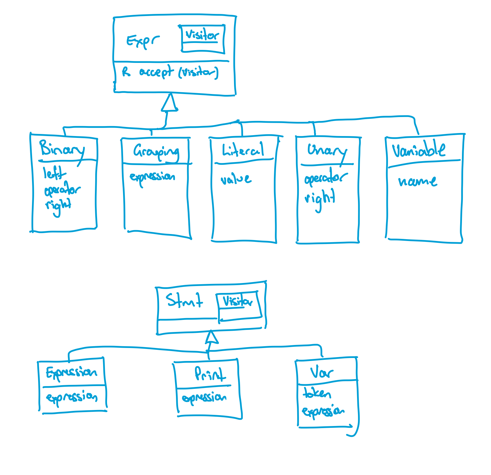

## Week Overview

This week we turn our focus to adding statements to our interpreter

## Goals

By the end of this week you should:

    * Be able to parse and represent non-variable statements
    * Be able to execute non-variable statements
    * Be able to parse and represent variable declaration and assignment

## Preparation
  * Read Sections 8.1 and 8.2 of chapter 8 of "Crafting Interpreters"
  * Watch the following echo360 videos
    - Generating Statements
    - Parsing Statements
    - Grammar tracing
    - Adding variables to expressions

**bindings**: Ask the internet what a _variable binding_ is and you will get all sorts of different answers.  Some say it is the binding of a variable to a scope.  Others say it is the binding of a variable to a location in memory, others say it is the binding of a value to a variable.  It can mean any of these things, but I think the second is closest for us.  The important thing about bindings is that once they exists, they persist.  That means we need to keep track of bindings.  So, they are always related to whats in a variable and always need tracking by an interpreter.

**side effect**: Anything a program does that is not _creating a value_ is called a side-effect.  _Creating_ a value is understood generously, you might think `+` only _changes_ values but it actually takes two existing values and creates a new one.  So anything that returns, creates, computes a value is excluded from this discussion.  Everything _else_ has a side-effect.  The side-effect of a variable declaration is the creation of a new binding.  The side-effect of a `print` statement is that the console output changes.  The side-effect of assignment is that a variable location changes. On and on it goes.  Statements have side-effects, expressions have values.

# FAT 

## adding variables <tex-essay>
question: |
  I expect this week's work to come as a great relief - we are adding variable declarations to our parser!

  Up to now you have had to put every program into a single expression and I am sure you will agree that has been getting painful.  With the addition of statements as explained in the text book, we can finally split up our programs and make them readable.
  \begin{note}
  Last week we wrote an evaluator but we are only partly working out the evaluation for this new form.  We are adding variable declarations and use and a print statement but evaluation of variables won't be complete until after next week.  Concentrate on re-writing your example programs and getting the new versions to parse.
  \end{note}

  Last week I showed you this program for Devlin's creek in one of the formats I have been working with

  \begin{lstlisting}
  4R + (2.2R + 8R + (1.2R + 6R))
  \end{lstlisting}

  With variables, I can rewrite it as

  \begin{lstlisting}
  var mahers_creek  = 6R;
  var joes_creek    = 1.2R;
  var lower_joes    = 2.2R + mahers_creek + joes_creek;
  var devlins_creek = 8R;
  var lower_devlins = 4R + lower_joes + devlins_creek;
  print(lower_devlins);
  \end{lstlisting}

  I find this \emp{so much easier to read}.  Your task this week is to do the same for the language your team has been developing.  Rewrite your example programs to use variables and adjust your implementation so it can parse these new programs correctly.

  This is a short application exercise, the remainder of class will be used to chat about assignment one.
  \newpage
answer: |
  Still to do.


# RAT

## variable decls <gift>
In the following code, which lines contain _variable declarations_.  Don't include variable _uses_ in your answer<br/>
```
var x = 1;
print x;
var y = 3;
print x + y;
```
{
  ~1 only
  =1 and 3
  ~2 only
  ~1, 2, and 4
  ~3 only
  ~none
}

## variable uses
In the following code, which lines contain _variable uses_.  Don't include variable _declarations_ in your answer<br/>
```
var x = 1;
print x;
var y = 3;
print x + y;
```
{
  ~1 only
  ~2 and 3
  ~2 only
  =2 and 4
  ~3 only
  ~none
}

## Implementing Print Statements <gift>
Which of the following best describes the role of the `visitPrintStmt()` method in the context of implementing print statements in Lox? {
    ~It prints the current state of the unevaluated expression to the console.
    =It evaluates the expression within the print statement and writes the result to the console.
    ~It declares a variable to store the value of the printed expression.
    ~It parses the expression in the print statement but does not evaluate it.
}

## Statement vs. Expression <gift>
What distinguishes a statement from an expression in the context of Lox's implementation?{
    ~There is no distinction.
    ~Statements are always enclosed in curly braces, while expressions are not.
    =Statements execute and produce effects, while expressions evaluate to a value.
    ~Statements can be nested within expressions, but expressions cannot be nested within statements.
}

## Parser changes <gift>
Which of the following is a change we made to the Grammar of chapter 7 to get statements to work?"{
  ~We allowed multiple expressions in a row
  ~We allowed operators to include other operators
  =We added some new productions to the grammar
  ~We created a print expression in the grammar
}

# SSE

## try a simpler grammar <essay>
question: |
  *NB: This question is prompting you to understand the system you have built.  The change is less important than knowing where the changes occur, why they occur there and why they don't occur in other places*

  Nystrom is looking ahead a little with his new grammar.  It is not _actually_ necessary at this point to have a separate `declaration` production.  I.e. the following grammar for statements will work (you need to fold in your own expression productions)
  ```
  program -> statement* EOF;
  statement -> varDecl
            |  exprStmt
            |  printStmt;
  ```
    Write out the full grammar using this approach and adjust your code so that is conforms to this grammar. Hint: Since the `Parser` is your implementation of the grammar, that will need to change.  Since your Interpreter walks the result of the parser, that will need to change as well.  Oh, and the AST was partly reflective of the grammar - That probably won't need to change because that detail of the grammar didn't make it to our AST.  Draw a diagram showing the classes your new AstGenerator is generating just to be sure.
answer: |
  ```
  program   -> statement* EOF;
  statement -> varDecl
            |  exprStmt
            |  printStmt;
  exprStmt  -> expression ";";
  printStmt -> "print" expression ";";
  varDecl   -> "var" IDENTIFIER ( "=" expression )? ";"; 
  expression     -> equality;
  equality       -> comparison (("!=" |"==" ) comparison )* ;
  comparison     -> term ( ( ">" | ">=" | "<" | "<=" ) term )* ;
  term           -> factor ( ( "-" | "+" ) factor )* ;
  factor         -> unary ( ( "/" | "*" ) unary )* ;
  unary          -> ( "!" | "-" ) unary
                 | primary ;
  primary        -> NUMBER | STRING | "true" | "false" | "nil"
                 | "(" expression ")" i
                 | IDENTIFIER;
  ```
  Here is my diagram
  
  Because I didn't end up with a `declaration` production, I also didn't end up with a `declaration` function, but it all fit just fine in the `statement` function.  I did have to think about the error catching though
  ```
  private Stmt statement() {
    try {
      if (match(PRINT)) return printStatement();
      if (match(VAR)) return varDeclaration();
      return expressionStatement();
    } catch (ParseError error) {
      synchronize();
      return null;
    }
  }
  ```

## complete the evaluator<essay>
question: |
  Without environments (next week) we can't correctly evaluate variables, but you can fill-in _stubs_ for those methods that just return null.  Do this and check your interpreter is working from end-to-end by running these programs.  When I went through this, I _think_ I found an ommission in the text.  I didn't notice any suggestion in this chapter that I need to update my `AstPrinter`.  But I really should since I've changed the methods in the `Expr.Visitor`, right?
answer: |
  I just needed two stubs in my `Interpreter`
  ```
  @Override
  public Object visitVariableExpr(Expr.Variable expr) {
      return null;
  }
  ```
  and
  ```
    @Override
    public Void visitVarStmt(Stmt.Var stmt) {
     return null;
    }
  ```

## Add our own statement <essay>
question: |
  Add a new type of statement to Lox.  The statement is `exit` and it should stop execution of the current program immediately.  You will need to touch most parts of the interpreter to make this work.  I will the attached answer is a full zip of the Lox interpreter as of week seven _and_ with the changes from the other class questions applied.  Note that _you_ will need to make decisions about how this new statement works.  The statements "stops execution immediately" seems clear but there are levels of detail unsaid.  Should it stop the interpreter as well?  Should it stop by throwing an error or some other mechanism?  As you implement your answer you should think about where you making these decisions and what you decided. 
answer: |
  There is a minor "trick" here - the exit statement is a terminal with no interesting data in it (i.e no fields are needed).  However, the AST code generation assumes there will be at least one, so we need to fix that.  You will see it in my diff below.  I know presenting an answer like this as a diff is not great, I will try and improve on it, but it is there for now
  `````
  51,56d50
  <   }
  < 
  <   @Override
  <   public Void visitExitStmt(Stmt.Exit exit){
  <     System.exit(0);
  <     return null;
  diff variants/week7_with_exit/Parser.java weeks/seven/Parser.java
  13,14c13
  <             |  printStmt
  <             |  exitStmt;
  ---
  >             |  printStmt;
  51,54d49
  <       if (match(EXIT)) {
  <         consume(SEMICOLON, "Expect ';' after exit statement");
  <         return new Stmt.Exit();
  <       }
  diff variants/week7_with_exit/Scanner.java weeks/seven/Scanner.java
  36d35
  <     keywords.put("exit",   EXIT);
  diff variants/week7_with_exit/Stmt.java weeks/seven/Stmt.java
  1c1
  9d8
  <     R visitExitStmt(Exit stmt);
  35,44d33
  <   }
  <   static class Exit extends Stmt {
  <     Exit() {
  <     }
  < 
  <     @Override
  <     <R> R accept(Visitor<R> visitor) {
  <       return visitor.visitExitStmt(this);
  <     }
  < 
  diff variants/week7_with_exit/TokenType.java weeks/seven/TokenType.java
  19c19
  <   PRINT, RETURN, SUPER, THIS, TRUE, VAR, WHILE, EXIT,
  ---
  >   PRINT, RETURN, SUPER, THIS, TRUE, VAR, WHILE,
  `````

## where are uses <essay>
question: |
  Explain, using a concrete example, where _variable uses_ are encoded in the following grammar
  ```
  program   -> statement* EOF;
  statement -> varDecl
            |  exprStmt
            |  printStmt;
  exprStmt  -> expression ";";
  printStmt -> "print" expression ";";
  varDecl   -> "var" IDENTIFIER ( "=" expression )? ";"; 
  expression     -> equality;
  equality       -> comparison (("!=" |"==" ) comparison )* ;
  comparison     -> term ( ( ">" | ">=" | "<" | "<=" ) term )* ;
  term           -> factor ( ( "-" | "+" ) factor )* ;
  factor         -> unary ( ( "/" | "*" ) unary )* ;
  unary          -> ( "!" | "-" ) unary
                 | primary ;
  primary        -> NUMBER | STRING | "true" | "false" | "nil"
                 | "(" expression ")" 
                 | IDENTIFIER;
  ```
answer: |
  It is on the very last line.  Variable uses appear as an identifier in an expression.  The identifier in the `varDecl` production is not a variable use, it is the variable declaration.  As a concrete example, consider the parse of the following program
  ```
  var x  = 3;
  print x;
  ```
  Will be
  ```
  program -> 
    [ statement -> varDecl  -> 
      "var" IDENTIFIER "x"
      ( "=" expression   -> equality -> comparison -> term -> factor -> 
        unary -> primary -> NUMBER -> 3
      ) ";"
    statement -> printStmt -> "print" expression -> equality -> comparison -> 
      term -> factor -> unary -> primary -> IDENTIFIER "x"
      ";"
    ]
  ```

# Exam

## variable decls <gift>
In the following code, which lines contain _variable declarations_.  Don't include variable _uses_ in your answer<br/>
```
var x = 1;
print x;
print x + 1;
```
{
  =1 only
  ~2 and 3
  ~2 only
  ~1, 2, and 3
  ~3 only
  ~none
}

## variable uses <gift>
In the following code, which lines contain _variable uses_.  Don't include variable _declarations_ in your answer<br/>
```
var x = 1;
print x;
print x + 1;
```
{
  ~1 only
  =2 and 3
  ~2 only
  ~1, 2, and 3
  ~3 only
  ~none
}