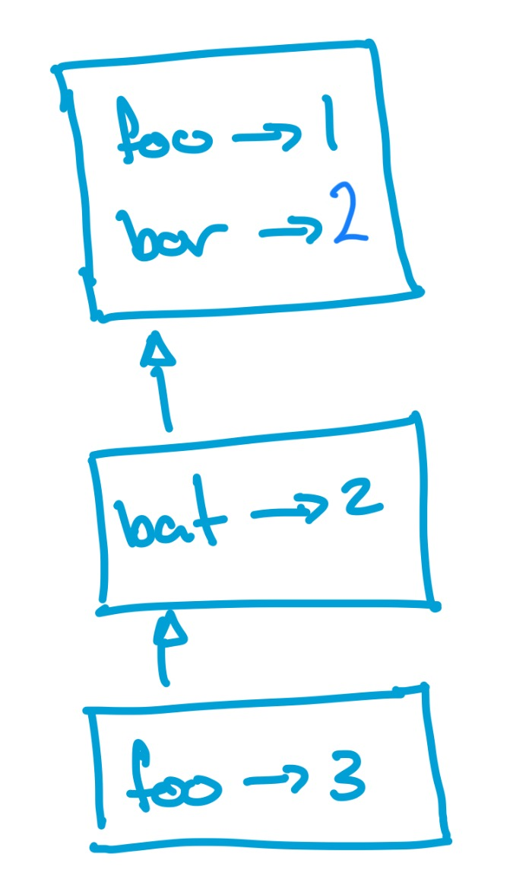

## Week Overview

This week we turn our focus to how an interpreter can keep track of variable and all the different possible design considerations at this point of implementation. 

## Goals

By the end of this week you should:

  * Be able to describe the operation of and trace environments for variable semantics.
  * Understand how environments can manifest local scope and variable shadowing.
  * Understand the design philosophy of Scala and be able to write some small Scala programs in the OO style.

## Preparation
  * Read the rest of Chapter 8 of "Crafting Interpreters"
  * Watch the following videos on echo360:
    - Intro and discussion of context
    - Blocks are statements
    - How assignment works


# FAT

## catching up <tex-essay>
question: |
  \begin{note}
  This week's exercise is a catch-up on weeks 7 and 8.  You can keep your powder dry on week 9 implementations until next week.  We hope some people explored these ideas in their submissions for assignment one, meaning we can take on something bigger this week to help catch up.
  \end{note}

  At this point, from earlier weeks and your work on assignment one, you should have some example expressions in your water flow languages.  My expression for the Devlin's creek looks like:

  \begin{lstlisting}
  4R + (2.2R + 8R + (1.2R + 6R))
  \end{lstlisting}
    
  I'm fairly sure you have all been wishing you had variables to work with, so now we will add them.
 
  With variables, I can rewrite the above example as

  \begin{lstlisting}
  var mahers_creek  = 6R;
  var joes_creek    = 1.2R;
  var lower_joes    = 2.2R + mahers_creek + joes_creek;
  var devlins_creek = 8R;
  var lower_devlins = 4R + lower_joes + devlins_creek;
  print(lower_devlins);
  \end{lstlisting}

  I find this \emp{so much easier to read}.  Your task this week is to do the same for the language your team has been developing.  Rewrite your example programs to use variables and adjust your implementation so it can parse these new programs correctly.

  \begin{note}
  If someone in your team did a particularly good job in assignment one, you could swap to building on that langauge instead of the team's shared language.  Taking the time to write things out clearly as done in the assignment can really help clarify the path forward
  \end{note}

  Once you have done this, write your Tree Walking Evaluator for \emph{your} team's language.
  
  At the end of class we hope you will be able to demonstrate your evaluator running to the class.

  \subsubsection*{The input?}
  One key question is "what is the input that the program runs on?"  My expression above assumes there is a rainfall history floating around that the executor can work on.  I chose to hard code the rainfall into my evaluator.  As evaluation progresses, the visitor itself has a rainfall history it can call on to compute the final \emph{value} which is emmitted from the program.  There are lots of other options and your team is free to use any they want.  A few sensible ones are:
  \begin{itemize}
  \item Hard code into the interpreter (as I have)
  \item Pull from the internet during run-time (most advanced approcah)
  \item Pass in on the command line
  \item Grab from an environment variable
  \end{itemize}

  \subsubsection*{The output}
  What will the output of the program be?  In Lox, we return a success code \emph{and} run any of the print commands.  We might not have print commands, will the program just silently run?  The whole point of this program is to work out the flow in the output river, so you should hard code your evaluator to print this value at the end of execution, whatever that value is.

  \begin{note}
  There is three weeks work bundled up in this tasks but you can get parts of it to work if you are not completely up to speed.  On the other hand, if you have a version of Lox that has kept up with the text, it won't actually take much work to get this part going.
  \end{note}
  \newpage

answer: |
  still to come

# RAT 

## simple <gift>
What is the main purpose of an "environment" within an interpreter
{
    ~ To store the syntax tree for parsing expressions.
    ~ To evaluate the code line by line at runtime.
    ~ To define how functions handle parameters and return values.
    = To map variable names to their corresponding values.
}

## declaring vars <gift>
When declaring a new variable in the current scope, how is it stored using environments?
{
    ~It overwrites any variable with the same name in all parent environments
    =It is added to the current environment without affecting parent environments.
    ~It creates a copy of the variable in all nested environments.
    ~It is stored globally, regardless of the current scope.
}
## which program <gift>
Which program will result in the following environment(s) being created by the interpreter immediately _after_ the statement `foo = 3;` is interpreted.
{
  ~```
foo = 1;
bar = 1;
bat = 2;
foo = 3;
```
  ~```
var foo = 1;
var bar = 1;
var bat = 2;
foo = 3;
```
  ~```
var foo = 1;
var bar = 1;
var bat = 2;
var foo = 3;
```
  =```
var foo = 1;
var bar = 1;
\{
var bat = 2;
\{
var foo = 3;
}
}
```
}

## landr <gift>
In this code snippet
```
var x;
var y;
var z = 3;
x = 5;
y = x;
x = z;
```
Match which variables are in l-value positions, which are in r-value positions and which are in both?{
  =x -> both
  =y -> l-value
  =z -> r-value
}

## best explanation <gift>
Which of the following is the most accurate explanation of why each environment needs a reference to a surrounding environment?{
  ~ The global environment is surrounded by the function environment
  ~ Various language features can merge two environments
  ~ Whenever a while loop is encountered, a new scope comes into existance
  = Every new block creates a separate scope that defers to its surrounding scope when necessary
}


# SSE

## writing up environments <essay>
question: |
  In this task we will learn how we can write up an environment diagram that might prove useful in an exam (hint).  Consider the following code
  ```
  var foo = 3;
  var bar;
  bar = foo;
  {
    var bat = 5;
    bar = bat;
  }
  ```
  Draw up two environment cactus's, one for the environments at the end of the program, and another for the environments just before 6th line of the program (the line is `bar = bat`)
answer: |
  Environments have a map of bindings _and_ a link to an enclosing environment.  I'm going to represent an environment with three vars in it like this
  ```
  ^
  -------
  var -> val
  var -> val
  var -> val
  --------
  ```
  The "^" symbol is pointing to the enclosing environment, which is empty here.  With this in place, we can give the environment at the end of the program
  ```
  ^
  -------
  foo -> 3
  bar -> 5
  --------
  ```
  At line 6 however, there are two live environments and my diagram looks like
  ```
  ^
  -------
  foo -> 3
  bar -> 3
  --------
  ^
  -------
  bat -> 5
  --------
  ```
  So now, if I ever ask for an environment diagram in an iLearn test, you have a nice notation that is pretty simple to type out.  Always best to draw out your solution on paper first though.

## wiring up environments 1 <essay>
question: |
  Draw an environment diagram for the state of the environment just before line 9 of this program (the line is `bat = foo`).  You may be asked a question like this in the exam so be sure to practice drawing environment diagrams in this way.
  ```
  var foo = 1;
  var bar;
  bar = foo;
  {
    var bat = 2;
    bar = bat;
    {
      var foo = 3;
      bat = foo;
    }
  }
  ```
answer: |
  ```
  ^
  -------
  foo -> 1
  bar -> 1
  -------
  ^
  -------
  bat -> 2
  -------
  ^
  -------
  foo -> 3
  -------
  ```

## the design choices <tex-essay>
question: |
  The text discusses a few design possibilities.
  \begin{enumerate}
    \item What happens if we use a variable before declaring it
    \begin{enumerate}
      \item static error
      \item allow forward references
      \item run time error
      \item allow this and give the variable the value \verb+nil+
    \end{enumerate}
    \item What happens if we do declare the variable but it's not been assigned a value?
    \begin{enumerate}
      \item static error disallowing
      \item static warning
      \item runtime error
      \item allow this and give the variable the value \verb+nil+
    \end{enumerate}
  \end{enumerate}
  Make a matrix/table/whatever you want to show all the possible combinations and identify all the nonsensical choices.  Can you identify where some languages you know sit in the matrix?
answer: |
  \begin{tabular}{l | l | l | l | l }
  \hline
  use $\downarrow$ declare $\rightarrow$ & error & warning & runtime & nil \\
  \hline
  static error & Haskell & & & Java \\
  allow forward references & & & &\\
  run time error & & & & Python \\
  allow and give \verb+nil+ & & & &\\
  \hline
  \end{tabular}
  Pass on your own ideas, we would live to fill out the table with langauges!

## strange <essay>
question: |
  Write some lox code (it can use lox features we haven't implemented yet if you like) which shows some of the "strange" or "interesting" things you can do because assignment is an expression in our parser.  What is the output expected of this code?
answer: |
  ```
  while (x = x - 1){
    print x;
  }
  ```
  Assignment in lox is an expression whose value is whatever value got assigned.  In this case it is `x-1` every time we go around the loop.  Lox also treats all integers as "truthy" so the value never trips the loop to stop.  Thus this loop will print from `x` to negative infinity.

# Exam

## wiring up environments <essay>
question: |
  Draw an environment diagram for the state of the environment just before 9 of this program (the line is `bat = foo`)
  ```
  var foo = 3;
  var bar;
  bar = foo;
  {
    var bat = 5;
    bar = bat;
    {
      var foo = 9;
      bat = foo;
    }
  }
  ```
answer: |
  ```
  ^
  -------
  foo -> 3
  bar -> 5
  -------
  ^
  -------
  bat -> 5
  -------
  ^
  -------
  foo -> 9
  -------
  ```

## strange (in sse as well) <essay>
question: |
  Write some lox code (it can use lox features we haven't implemented yet if you like) which shows some of the "strange" or "interesting" things you can do because assignment is an expression in our parser.  What is the output expected of this code?
answer: |
  ```
  while (x = x - 1){
    print x;
  }
  ```
  Assignment in lox is an expression whose value is whatever value got assigned.  In this case it is `x-1` every time we go around the loop.  Lox also treats all integers as "truthy" so the value never trips the loop to stop.  Thus this loop will print from `x` to negative infinity.

## landr <gift>
In this code snippet
```
var a;
var b;
var c = "there";
a = "hi";
b = a;
a = c;
```
Match which variables are in l-value positions, which are in r-value positions and which are in both?{
  =a -> both
  =b -> l-value
  =c -> r-value
}

