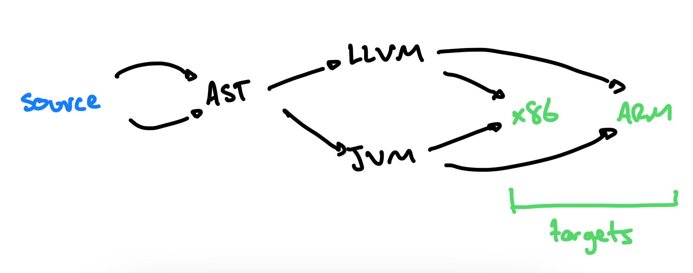

**pidgins**: A language with simplified grammar from another language and lots of loan-words from native languages.  My favourite is Tok Pisin.

**sound**: If you follow these rules, you won't do anything wrong

**complete**: If you follow these rules, you won't miss anything.

**stream**: Like an array or Vector but it arrives over time, not all at once.  _Files_ are commonly treated as streams because it takes time to get them from the hard drive and they might be much bigger than your memory.

# overall

## exam

### compiler parts
Match these compiler parts with a description of what they do{
    =scanner -> takes in the linear stream of characters and chunks them together into a series
    =parser -> takes the flat sequence of tokens and builds a tree structure that mirrors the nested nature of the grammar
    =static analysis -> get a high-level view of what the code is doing
    =optimization -> remove redundancy and do early computation
    =code generation -> output machine code
}

### ordering

Which of the following is the correct ordering for compiler phases{
    = scanner > parser > static analysis > code generation
    ~ parser > scanner > static analysis > code generation
    ~ scanner > parser > code generation > static analysis
    ~ parser > scanner > code generation > static analysis
    ~ scanner > code generation > parser > static analysis
    ~ scanner > static analysis > parser > code generation
}

# The concept of little languages

## RAT

## SSE

### Text Exercises
Complete challenge 1 and 2 from  Chapter 1 of the text. Put your answers in here{}

### pick a little language <essay>
question: |
  Find a "little language" you have used somewhere
answer: |
  The command language in minecraft is _almost_ a little language but it does not include any control flow so perhaps that is being generous?  Though redstone can get you control flow.  Little languages are often very restricted and rely on machinery from elsewhere to do the hard work, so I think it counts in the end.  More likely you will have used BASH, which is the little language you use whenever you do something in the command line.  It has heaps of features you never thought to use.

### regex <essay>
question: |
  Regular expressions are a "little language" and it never hurts to brush up on them.  I recommend [regexr](https://regexr.com/).  Write a regular expressions that will work over the following text to extract:

    * every instance of "the the" and "teh" (common errors)
    * The last word of every sentance
    * All characters in the scene
    * All the scene directives

  > (Opening scene:  A table golf set.  As the camera pulls back, CAT's head
  > rises into view over the edge of the the table.  He is wearing a rather
  > ridiculous multi-coloured tammy, a red golfing jumper with a large 'Red
  > Dwarf' badge and garish plus fours.  He is carefully lining up a shot.)
  > 
  > CAT: (Rising) Okay, okay, okay.  Uphill, slight barrow to the left.
  > 
  > (He pulls back the club on his miniature golfer, causing it to putt the
  > ball into the hole.)
  > 
  > CAT: (Ecstatic) Yes, yes, yes, YES!  Yow!
  > 
  > (He switches on a tape recorder sitting beside the scaled-down green.
  > Cheering and applause emerge from the speakers.  CAT bows and blows
  > kisses happily.  The camera pans to teh right, and we see LISTER, who is
  > sitting with arms folded, looking rather unhappy.)
  > 
  > CAT: (In LISTER's face) Yay!  Four up, with six to play!  This guy is
  > hot, hot, HOT!  Okay, hole 13.
  > LISTER: What am I doing?  What am I doing here?
  > CAT: You're not following through is what you're doing!  Keep your head
  > down and follow through!
answer: |
  * `/(the the|teh)/`
  * `/\S[A-z]*\./`
  * `/^[A-Z]*:/`
  * `/\([\S\s]*\)/gmU`
    
# The compiler interpreter pipeline

## RAT 

### parts
Match these compiler parts with the order in which they would appear if they were the only parts of the pipeline{
  =scanner -> 1
  =parser -> 2
  = evaluation -> 3
}

### tree walker
Which of the following phases would be left out of a "tree walk interpreter"? _warning, selecting incorrect answers will incur negative marks_{
    ~-50% scanner
    ~ 50% code generation
    ~ 50% runtime
    ~-50% parsing
}

## SSE
### counting branches html

Imagine the following diagram of programming language implementation options is <em>sound</em> and <em>complete</em>.  We want to create a compiler/interpreter to convert our "source" language into one of out target languages (x86 or ARM).
  

How many different possible implementations are there? (Hint, this is a COMP2010 question)
{=8}

### exits <essay>
question: |
  There are multiple end-points for the paths over the mountain, what are they?
answer: |
    * High level language, or
    * Bytecode, or
    * Machine Code

### combining optimisations <essay>
question: |
  There in an optimisation called _constant propagation_ which notices if a variable never changes and replaces all instances of that variable with the value it will always have.  The textbook talked about _constant folding_.  Can you think of a program (in whatever lanuage you like) were _constant propagation_ might open up new opportunities to do _constant folding_?
answer: |
  Here is mine (in Ruby)
  <pre>
  x = 5  # x is a constant and never changes
  puts 5 * x
  </pre>
  The 5*x is not ready for constant folding _until_ we realise the x will always be 5, then the program can be transformed to
  <pre>
  puts 5*5
  </pre>
  Which can be optimised with constant folding to
  <pre>
  puts 25
  </pre>

### transpiler 
Which of the following phases would be left out of a "transpiler"? _warning, selecting incorrect answers will incur negative marks_{
    ~-50% scanner
    = 50% code generation
    = 50% runtime
    ~-50% parsing
}

# Compilers vs Interpreters

## RAT

### real compiler
Which of these characteristics would make a language implementation _certainly_ a compiler{
  =code generation
  ~scanning
  ~parsing
  ~interpretation
}

## SSE

### compiler or interpreter <essay>
question: |
  Discuss which of the following are compilers and which are interpreters

    * Java
    * Javascript
    * Processing
    * C
answer: |
  Key to this question is that these are languages and we can't answer for languages.  We can only answer for particular language implementations!  However, most languages come with standard implementations _or_ the implementations all use the same general approach.  For Java/Processing/C, all implementations are compilers.  For JavaScript there are _both_ compiled and interpreted implementations.

### hypothetical <essay>
question: |
  If I told you I had a program which did a "quick and dirty" conversion from BASH script to Ruby, would you think it was a compiler or an interpreter?  Justify your choice.
answer: |
  This would have to be a compiler!  It _sounds like_ an interpreter because it is "quick and dirty" but it doesn't actually run any code!  It takes code in a source language and converts it to another language. It just so-happens the "other" language is commonly used as a source language.  Even the assembly code you are used to generating in a compiler is actually run through an interpreter in the end (really, it is true) so having Ruby as a target language is not so strange after all.

### Real interpreter <essay>
question:
  What is a programming language implementation you know of that _certainly_ is an interpreter rather than a compiler
answer:
  The text identifies early versions of Ruby, I will nominate `sed` which does stream editing on unix.  `sed` has a configuration language that is easily a domain specific language for making changes to a text file

### compiler or interpreter
In your own words, give _a single sentence_ that describes _the most important_ distinction between compilers and interpreters{}

### why not language
In your own words, explain why it is not meaningful to ask if a language is compiled or interpreted{}