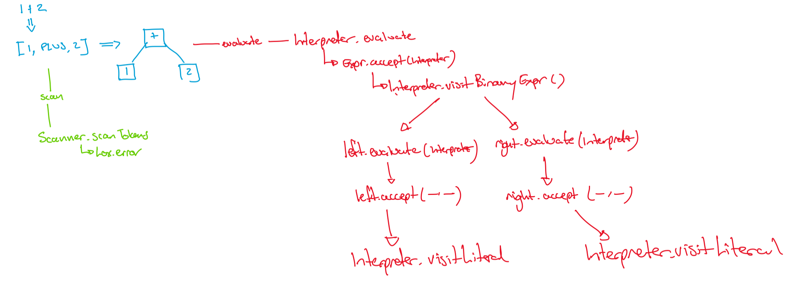

**values vs computation**: Computing never escapes the duality of code and data.  Your computer memory has code mixed with data.  Up to now we have separated _expressions_ from _statements_ (statements are code only, expressions are data that might need computing).  We will now talk more about _values_ vs _computation_.  

**declarative**: A _declarative_ programming language is one in which you only say _what to do_ not _how to do it_.

**boxed types**: in languages like Java the system offers both reference types (objects) and value types (primitive types). Each of the value types that Java supports is complemented by a reference type that contains a read-only copy of the value represented inside an object. This provides a reference so as to allow the use of all the facilities provided by the Java API with these values.

# Representing Values

## RAT

### match
Match each of these Lox concepts with the phase of the interpreter they fit into{
    =TokenType => Scanner
    =Expr => Parser
    =Object => Interpreter
}

### why
In creating Lox, we built special classes for Tokens and Abstract Syntax Tree nodes, but we did not do the same for _values_.  Which of following is the best explanation for why we didn't{
    =The built-in `Object` worked well for the task.
    ~The built-in primitive types worked well for task.
    ~There is no difference between Java and Lox at the value level.
    ~We didn't know how to yet.
}

### not true
Which of the following  _not true_  of the relationship between expressions and values{
    ~expressions are AST nodes that become values when evaluated
    ~all expressions can have a value
    =all expressions are also values at all times
    ~the parser creates expressions, the interpreter creates values
}

## SSE
### value vs expression <essay>
question: |
    Based on what you understand an _expression_ and a _value_ to be, write one sentance that explains the difference in the most pithy way you can.
answer: |
    We want to see all your classmate's answers as well, but here is mine.  A _value_ is an _expression_ that has been _evaluated_ as far as possible.

### alternatives to objects <essay>
question: |
    In Lox, the `Object` type is used to store values.  Describe an alternative approach that could also work.  Your answer should include an explanation of _why_ that would work and _how_ that would work.
answer: |
    We could use primitive types. To make this work would require different evaluation functions based on the type of the expression being evaluated and this would also require some more analysis on the parse tree to work this out before trying to evaluate.

# Evaluation is a tree-walk

## RAT

## SSE

### do a trace <essay>
question: |
    In lectures, Matt will trace an evaluation tree walk for a given expression.  Do a trace of these Lox expressions:
    
      * `1 + "hi"`
      * `true && false || true`
      * `5 - false`
    
    You can use your own notation and style of the trace but you should end up with some diagram you can upload as your answer to this question.
answer: |
    No answer provided here because each class will come up with their own preferred answer.  When you are doing your own trace, you should use your own notation and include the information that matters to _you_.

### refactor and justify your improvement <essay>
question: |
    Nystrom's code is wonderful, but it can be improved.  Specifially in `Interpreter.java`, perform some refactoring that you think is an improvment and justify your choice.
answer: |
    I see two.  One is to use pattern matching instead of `instanceof`.  It is true we don't use the full benefit of pattern matching, but it is the new idiomatic Java, so why not?  The other is to overload `checkNumberOperands` instaed of having two different functions.  This will particularly pay off if we ever have a ternary or more that need checking as well.

# Runtime errors

## RAT

## SSE

### inconsistent error reporting <essay>
question: |
    If I had said "run time errors are not being treated the same way as compile time errors in the Lox interpreter" and you were left with the job of explaining what that statement meant, how would you go about explaining it?  With reference to you answer to the previous class question, why is it done this way?
answer: |
    In this diagram I show scanning (in green) and evaluating (in red) the same expression.  I've traced out every function call that occurs in the process.  Note the notation is my own, you don't need to understand every little details.  The main point is that scanning is just one function which can call the error function on Lox if needed whereas evaluation is a tree of recursive function calls and an error could appear anywhere.  Getting from error location to error reporting in the green trace is easy but in the red trace you would have more things to keep track of to ensure it all works right.  Exceptions are designed for exactly this case, so exceptions are used for the interpreter while simple returns were sufficient in the scanner
    